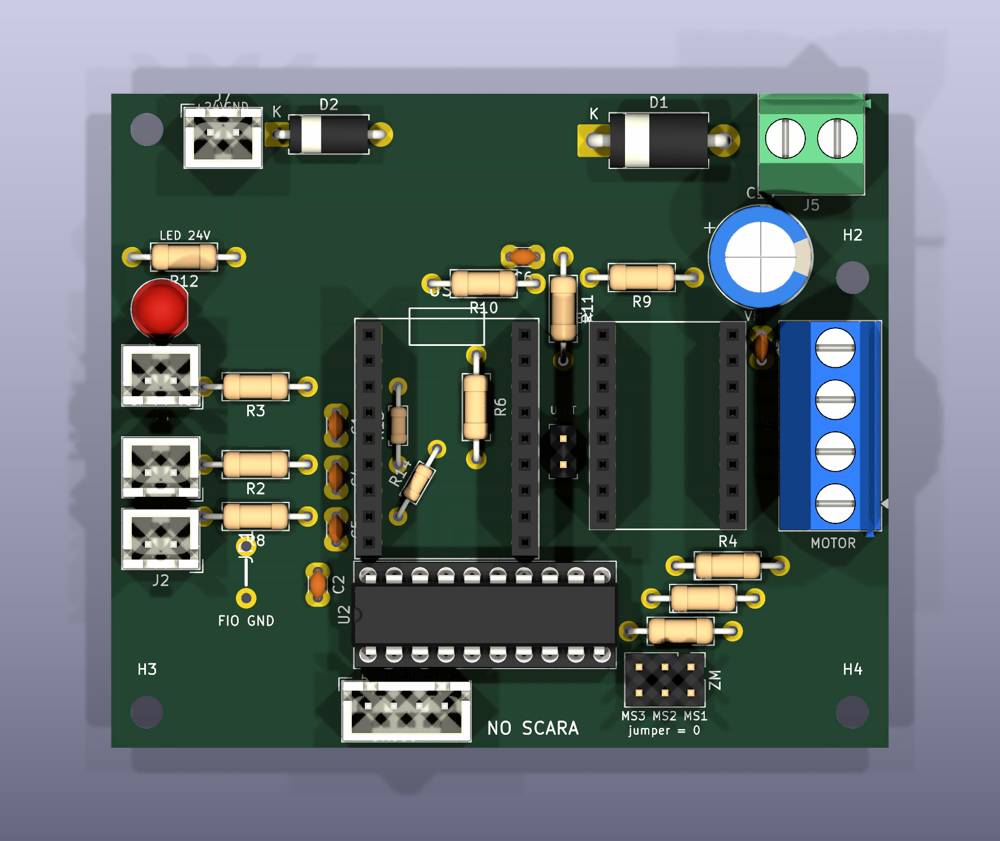
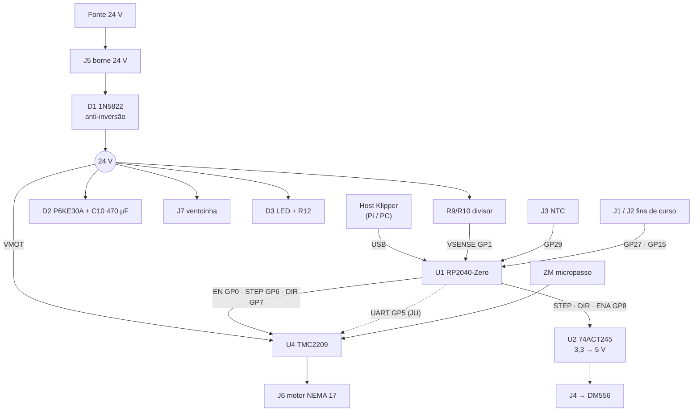

# 1. Visão geral

## O que a placa faz

Cada nó controla **um motor** do SCARA. O RP2040-Zero roda o firmware do Klipper e conversa com o host
(Raspberry Pi ou PC) pelo USB. O host coordena os quatro nós:

| Nó | Junta | Motor | Driver |
|---|---|---|---|
| J1 | ombro | NEMA 23 | DM556 externo, pelo conector J4 |
| J2 | cotovelo | NEMA 17 | TMC2209 no soquete U4 |
| Z | vertical | NEMA 23 | DM556 externo, pelo conector J4 |
| J3 | rotação da ferramenta | NEMA 17 | TMC2209 no soquete U4 |

É a **mesma placa nos quatro nós**. Só muda o que se monta nela:

| Variante | Monta | Fica vazio |
|---|---|---|
| **TMC2209** (J2, J3) | tudo, inclusive C3, R4–R7, ZM, JU, J6 e o módulo TMC2209 | J4 pode ficar sem cabo (o 74ACT245 não atrapalha) |
| **DM556** (J1, Z) | tudo menos o módulo TMC2209 | soquete U4 e borne J6 vazios; R4–R7, ZM e JU opcionais |

## Especificações

| Item | Valor |
|---|---|
| Dimensões | 76 × 64 mm, 4 furos M3 (Ø3,2) a 3,5 mm das bordas; [desenho mecânico](03-fabricacao.md#desenho-mecânico) |
| Material | FR-4 1,6 mm, cobre só embaixo (B.Cu), fresada |
| Alimentação de potência | 24 V no borne J5 (protegida contra inversão e surto) |
| Alimentação da lógica | 5 V e 3,3 V do USB do RP2040-Zero (ver [por que não há entrada 5 V](08-testes.md#o-que-a-placa-não-faz)) |
| Controle | Klipper, um RP2040-Zero por motor, USB para o host |
| Driver interno | TMC2209 StepStick: 1,0–1,2 A RMS na prática |
| Driver externo | DM556 (ou similar, opto de ânodo comum): PUL, DIR e ENA em 5 V |
| Entradas | NTC do motor, 2 fins de curso, monitor da 24 V |
| Saídas | motor (4 fios), ventoinha 24 V, PUL/DIR/ENA para driver externo, LED de 24 V |

## Diagrama de blocos

## Blocos e peças

| Bloco | Peças | Função |
|---|---|---|
| Entrada 24 V | J5, D1, C10, D2, D3, R12, J7 | Recebe a 24 V. D1 protege contra inversão, D2 (TVS) contra surto, C10 guarda a energia de frenagem do motor, D3 acende com 24 V, J7 alimenta a ventoinha. |
| Monitor de 24 V | R9, R10, C6, R11 | Divisor 47k/5k6 leva 24 V a ~2,5 V no GP1. Se a potência cair, o Klipper faz M112. |
| Cérebro | U1 RP2040-Zero | Gera STEP/DIR, lê os sensores, fala com o host por USB. Fornece o 5 V (do USB) e o 3,3 V (regulador do módulo). |
| Driver TMC2209 | U4, R6, C3, J6 | Módulo StepStick. R6 deixa o driver desligado até o Klipper assumir. C3 desacopla o VMOT. J6 é o borne do motor. |
| Micropasso / UART | R4, R5, R7, ZM, JU | Pull-ups de 10k em MS1/MS2/MS3, com o jumper ZM para aterrar. JU fechado liga o GP5 ao PDN_UART. |
| Saída DM556 | U2, C2, J4 | Buffer de 3,3 para 5 V. As saídas afundam PUL−, DIR− e ENA− do DM556 (ânodo comum no 5 V). |
| NTC e fins de curso | J1, J2, J3, R2, R3, R8, R13, R14, C1, C4, C5, JP1 | NTC com pull-up de 100k no ADC. Chaves para GND com pull-up de 10k e filtro RC. JP1 é o fio que leva o GND para esta coluna. |

Detalhes e contas no capítulo [6. Circuitos](06-circuitos.md).
