# 2. Lista de materiais

A lista de compras oficial é [`production/BOM.csv`](../production/BOM.csv), gerada direto da placa. Este capítulo mostra **cada item** com uma foto de referência, o modelo 3D usado no
KiCad e o lugar exato na placa (vista de cima, peça em laranja).

> Fotos marcadas como *ilustrativa* mostram uma peça do mesmo tipo, mas não o modelo exato (ex.: LED de
> 5 mm no lugar do de 3 mm). O que vale é a coluna **Comprar**. Créditos e licenças das fotos:
> [`img/componentes/CREDITOS.md`](img/componentes/CREDITOS.md).

## Resumo

| Qtd | Item | Referências |
|---|---|---|
| 1 | Waveshare RP2040-Zero | U1 |
| 1 | Módulo TMC2209 StepStick (só nós NEMA 17) | U4 |
| 1 | SN74ACT245N DIP-20 | U2 |
| 1 | Schottky 1N5822 | D1 |
| 1 | TVS P6KE30A | D2 |
| 1 | LED 3 mm | D3 |
| 1 | Eletrolítico 470 µF 35 V | C10 |
| 4 | Cerâmico 100 nF | C1 C2 C3 C6 |
| 2 | Cerâmico 10 nF | C4 C5 |
| 6 | Resistor 10k 1/4 W | R4 R5 R6 R7 R11 R12 |
| 2 | Resistor 10k 1/8 W | R13 R14 |
| 2 | Resistor 1k 1/4 W | R2 R8 |
| 1 | Resistor 100k 1/4 W | R3 |
| 1 | Resistor 47k 1/4 W | R9 |
| 1 | Resistor 5k6 1/4 W | R10 |
| 1 | Borne 2 vias 5,08 mm | J5 |
| 1 | Borne 4 vias 5,08 mm | J6 |
| 1 | KF2510 4 vias | J4 |
| 4 | KF2510 2 vias | J1 J2 J3 J7 |
| 1 | Barra macho 2x3 + 3 jumpers | ZM |
| 1 | Barra macho 1x2 + 1 jumper | JU |
| 2 | Barra fêmea 1x9 | soquete do U1 |
| 2 | Barra fêmea 1x8 | soquete do U4 |
| 1 | Soquete DIP-20 (opcional) | U2 |
| 4 | Parafuso M3 + espaçador | H1–H4 |
| — | Fio rígido | JP1 |

**Fora da placa:** NTC 100k B3950 com fio (J3), duas chaves fim de curso NA ou NF (J1/J2), ventoinha
24 V (J7), cabo USB-C, fonte de 24 V. Nos nós J1 e Z: driver DM556 e motor NEMA 23.

<table><tr>
<td align="center">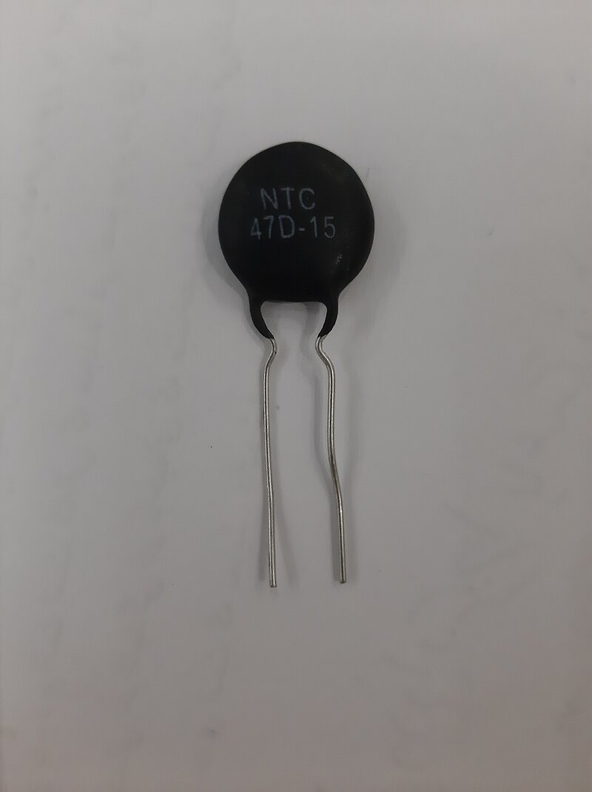 NTC 100k (ilustrativa)</td>
<td align="center">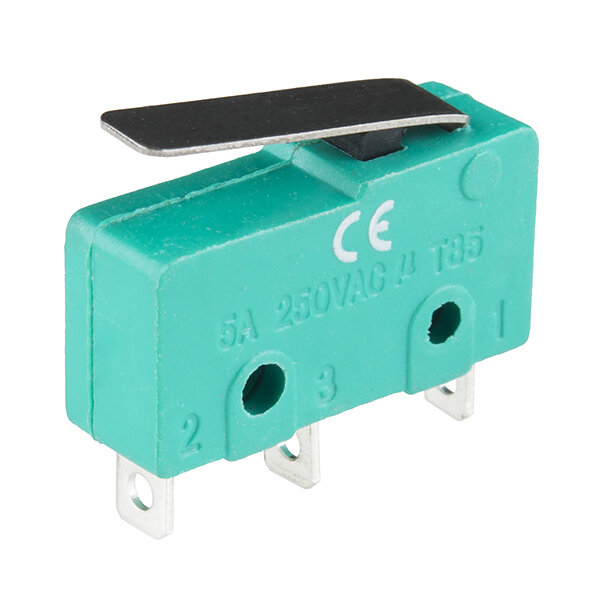 Chave fim de curso</td>
<td align="center">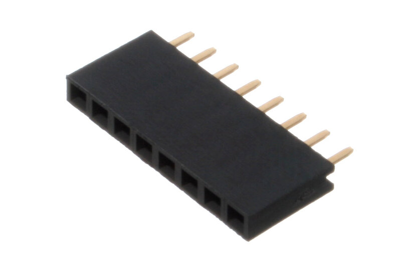 Barra fêmea (soquetes)</td>
<td align="center">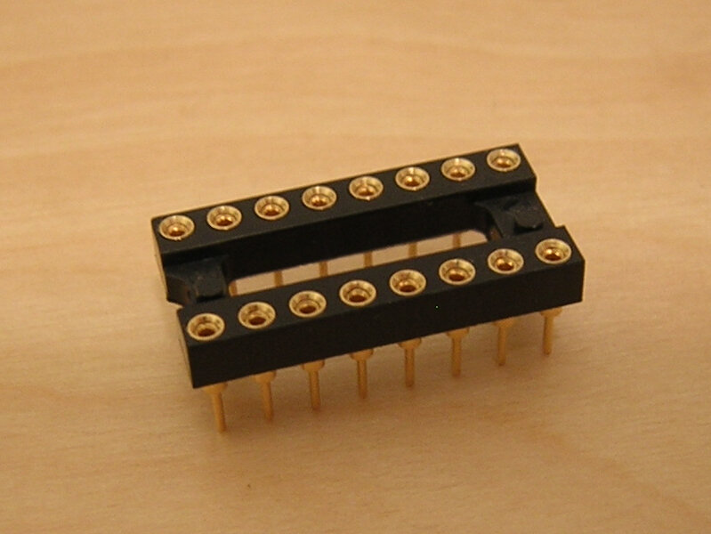 Soquete DIP (ilustrativa)</td>
</tr></table>

## Item por item

### RP2040-Zero (U1)

| Qtd | Referências | Valor | Comprar |
|---|---|---|---|
| 1 | U1 | RP2040-Zero | Waveshare RP2040-Zero + 2 barras fêmea 1x9 2,54 mm |

<table><tr><td align="center">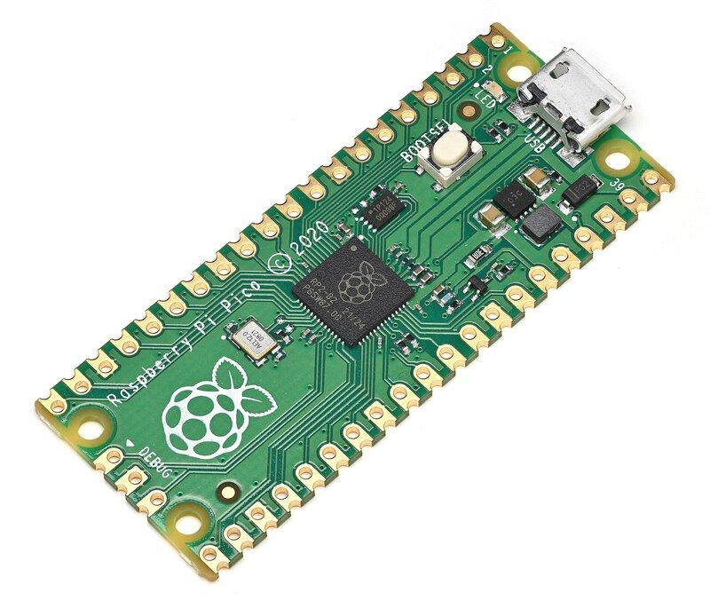 Foto (ilustrativa)</td><td align="center">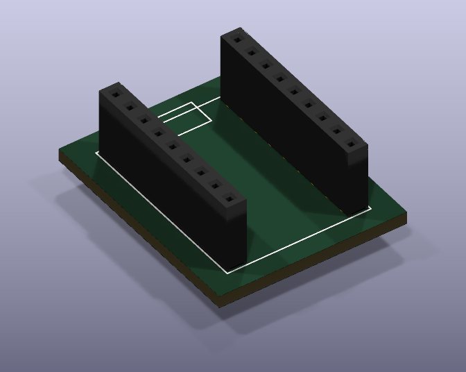 Modelo 3D (KiCad)</td><td align="center"> Onde fica</td></tr></table>

Vai em soquete (barra fêmea), nunca soldado direto. USB-C para **cima**, na borda superior. A foto é de um Raspberry Pi Pico (mesmo chip RP2040); o RP2040-Zero é bem menor.

### Driver TMC2209 (U4)

| Qtd | Referências | Valor | Comprar |
|---|---|---|---|
| 1 | U4 | TMC2209 | Módulo TMC2209 StepStick + 2 barras fêmea 1x8 2,54 mm |

<table><tr><td align="center">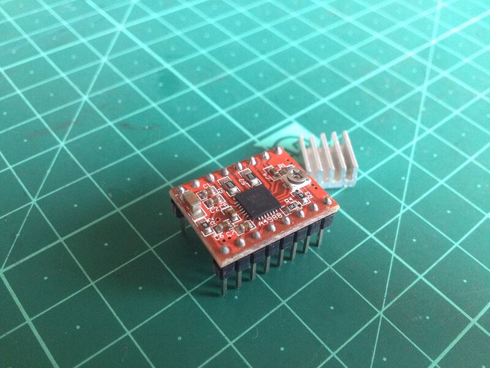 Foto (ilustrativa)</td><td align="center">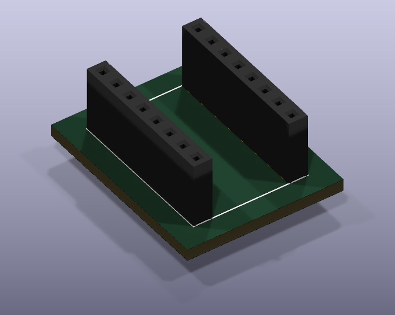 Modelo 3D (KiCad)</td><td align="center"> Onde fica</td></tr></table>

Só nos nós com NEMA 17. Pino **EN** no canto marcado EN (ao lado do GP0 do RP), **VM** no canto marcado VM. Módulo usado no projeto: chip embaixo, trimpot em cima, RSENSE 0,11 Ω. A foto mostra um StepStick A4988 (mesmo formato).

### Buffer 74ACT245 (U2)

| Qtd | Referências | Valor | Comprar |
|---|---|---|---|
| 1 | U2 | 74ACT245 | SN74ACT245N DIP-20 (74HCT245N também serve) + soquete DIP-20 opcional |

<table><tr><td align="center">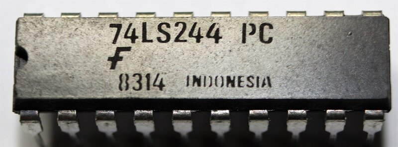 Foto (ilustrativa)</td><td align="center">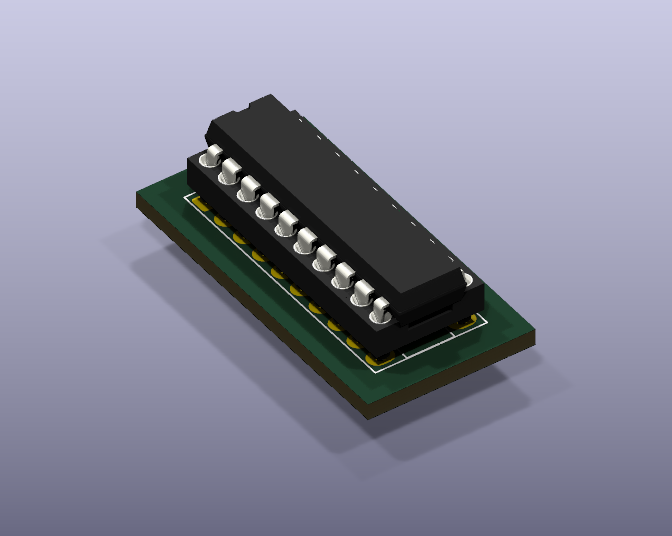 Modelo 3D (KiCad)</td><td align="center"> Onde fica</td></tr></table>

Chanfro/pino 1 para a **esquerda** (pino 1 = ilha quadrada, fileira de baixo). **Não** use 74HC245 (sem o T): com 5 V ele não reconhece os 3,3 V do RP como nível alto. A foto é de um 74LS244, que tem o mesmo encapsulamento.

### Diodo Schottky 1N5822 (D1)

| Qtd | Referências | Valor | Comprar |
|---|---|---|---|
| 1 | D1 | 1N5822 | Schottky 3 A 40 V, DO-201AD |

<table><tr><td align="center">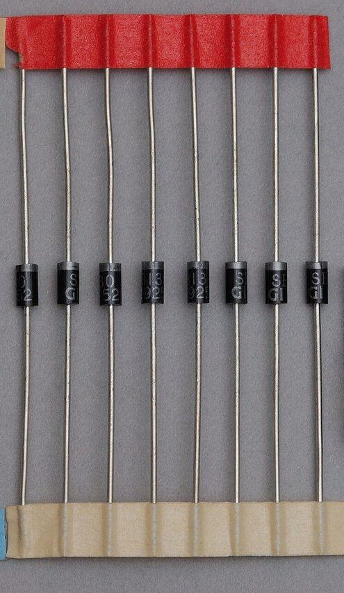 Foto (ilustrativa)</td><td align="center">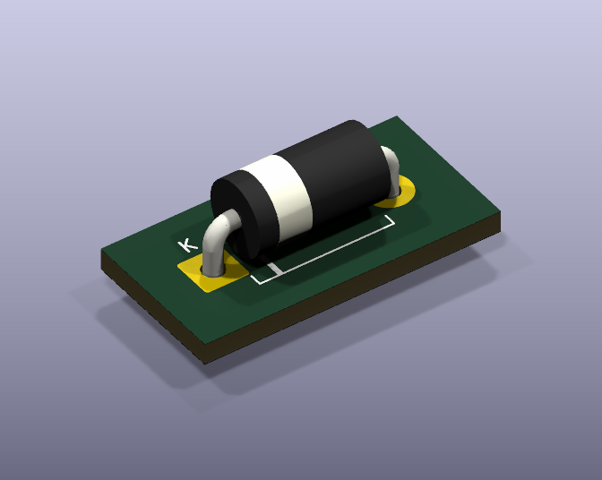 Modelo 3D (KiCad)</td><td align="center"> Onde fica</td></tr></table>

⚠️ Faixa do catodo para a **esquerda** (ilha quadrada). Invertido, a placa não liga. Perna grossa: furo de 1,6 mm. A foto mostra Schottky DO-41 (menores); o DO-201AD tem o corpo de ~5 mm.

### TVS P6KE30A (D2)

| Qtd | Referências | Valor | Comprar |
|---|---|---|---|
| 1 | D2 | P6KE30A | TVS 600 W unidirecional, DO-15 |

<table><tr><td align="center">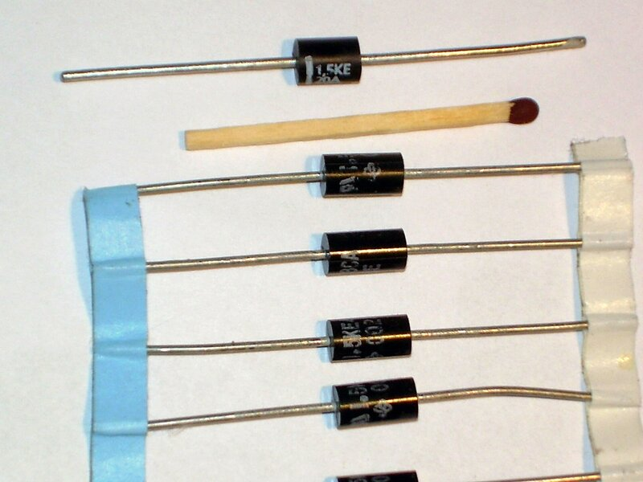 Foto (ilustrativa)</td><td align="center">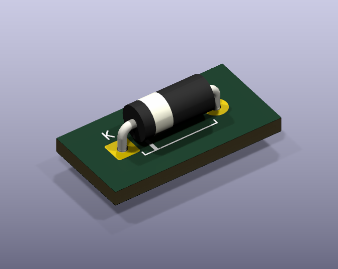 Modelo 3D (KiCad)</td><td align="center"> Onde fica</td></tr></table>

⚠️ Faixa do catodo para a **esquerda** (ilha quadrada, lado do 24 V). Invertido, o TVS fica em curto com a 24 V. A foto é de um 1.5KE (DO-201), maior que o DO-15.

### LED 24 V (D3)

| Qtd | Referências | Valor | Comprar |
|---|---|---|---|
| 1 | D3 | LED 3 mm | LED comum 3 mm, qualquer cor |

<table><tr><td align="center">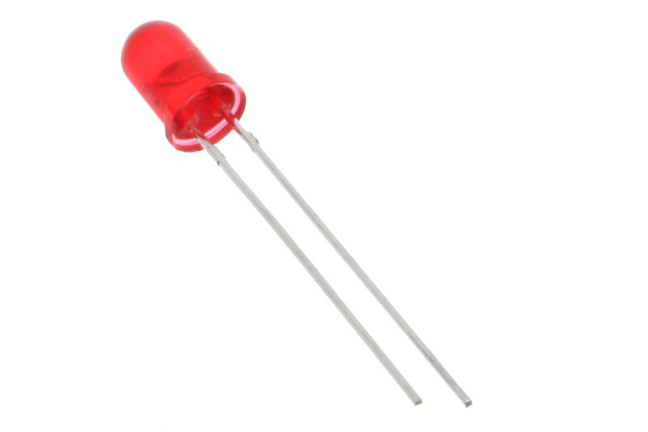 Foto (ilustrativa)</td><td align="center">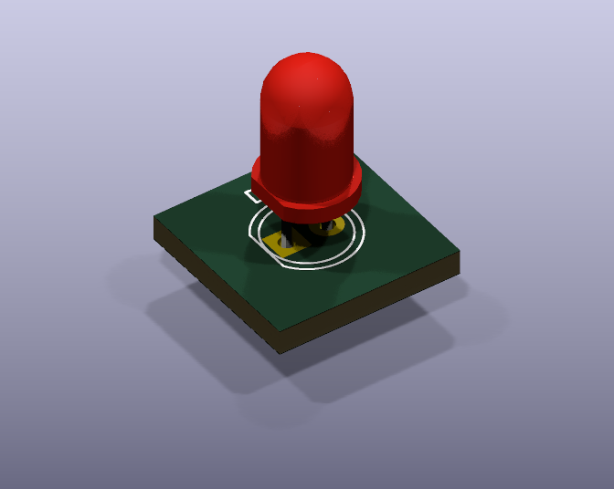 Modelo 3D (KiCad)</td><td align="center"> Onde fica</td></tr></table>

Perna curta (catodo, lado chato) na ilha **quadrada**, à direita. A foto mostra um LED de 5 mm.

### Capacitor eletrolítico 470 µF (C10)

| Qtd | Referências | Valor | Comprar |
|---|---|---|---|
| 1 | C10 | 470 µF 35 V | Eletrolítico 470 µF 35 V, Ø10 mm, passo 5 mm, 105 °C |

<table><tr><td align="center">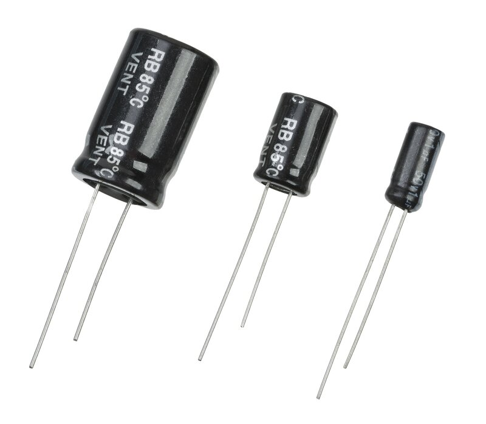 Foto</td><td align="center">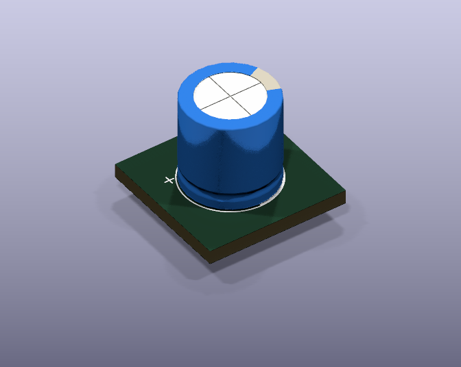 Modelo 3D (KiCad)</td><td align="center"> Onde fica</td></tr></table>

⚠️ Perna longa (+) na ilha **quadrada**, à esquerda. Faixa branca (−) para o lado do H2. Encaixa entre o borne J5 e o furo H2, sem folga para inclinar.

### Capacitores cerâmicos 100 nF

| Qtd | Referências | Valor | Comprar |
|---|---|---|---|
| 4 | C1 C2 C3 C6 | 100 nF | Cerâmico 100 nF 50 V, passo 2,5 mm |

<table><tr><td align="center">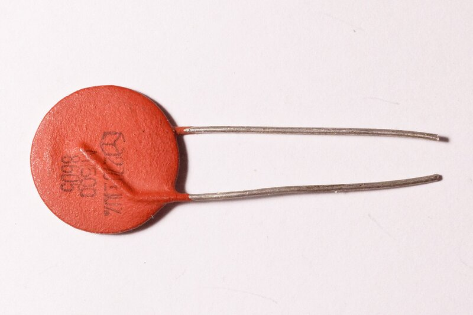 Foto</td><td align="center"> Modelo 3D (KiCad)</td><td align="center"> Onde fica</td></tr></table>

Sem polaridade. C3 fica junto ao VMOT do TMC; C6 fica embaixo do plugue USB (use peça baixa).

### Capacitores cerâmicos 10 nF

| Qtd | Referências | Valor | Comprar |
|---|---|---|---|
| 2 | C4 C5 | 10 nF | Cerâmico 10 nF 50 V, passo 2,5 mm |

<table><tr><td align="center"> Foto</td><td align="center">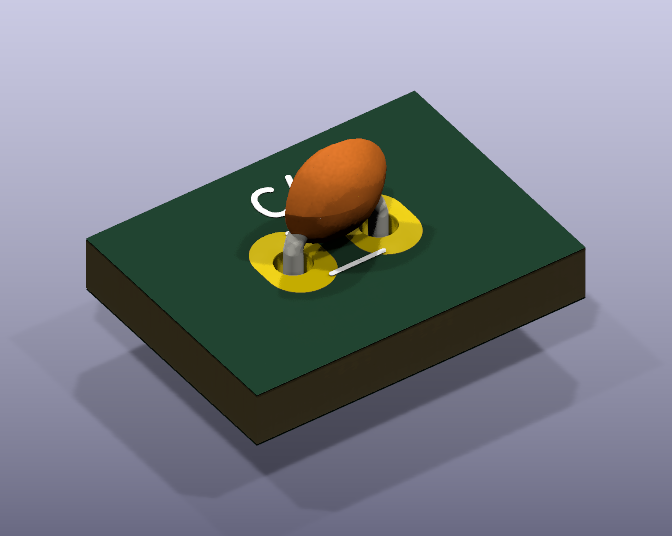 Modelo 3D (KiCad)</td><td align="center">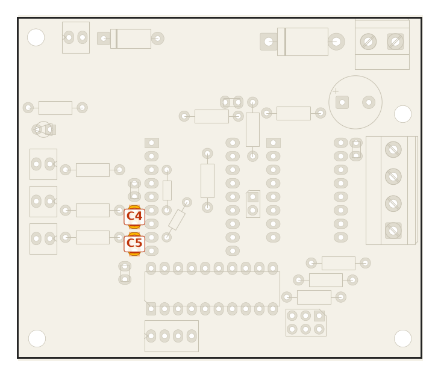 Onde fica</td></tr></table>

Sem polaridade. Filtro dos fins de curso.

### Resistores 10 kΩ (1/4 W)

| Qtd | Referências | Valor | Comprar |
|---|---|---|---|
| 6 | R4 R5 R6 R7 R11 R12 | 10k | Resistor 1/4 W 5%, furos a 10,16 mm |

<table><tr><td align="center">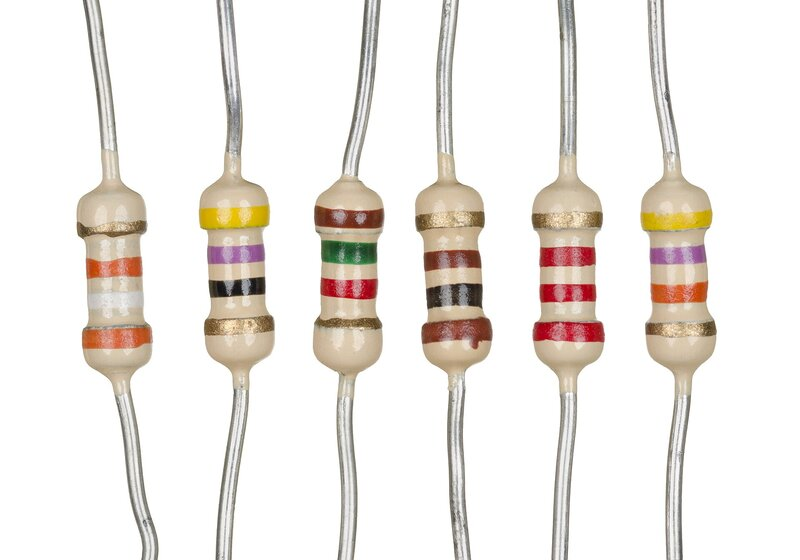 Foto</td><td align="center"> Modelo 3D (KiCad)</td><td align="center"> Onde fica</td></tr></table>

Sem polaridade, todos deitados. R6 e R11 ficam na vertical do desenho. R12 limita o LED; 4k7 dá mais brilho.

### Resistores 10 kΩ (1/8 W)

| Qtd | Referências | Valor | Comprar |
|---|---|---|---|
| 2 | R13 R14 | 10k | Resistor 1/8 W 5% (corpo 3,6 × 1,6 mm), furos a 7,62 mm |

<table><tr><td align="center"> Foto</td><td align="center">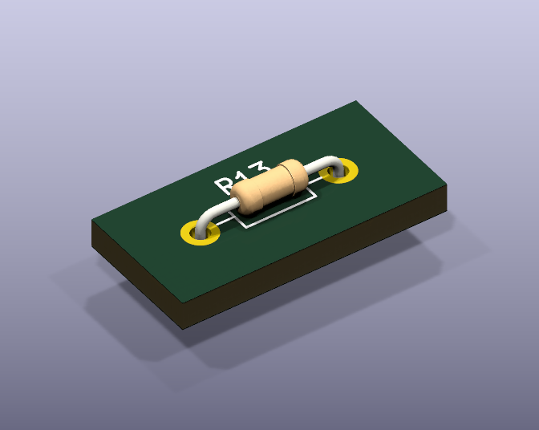 Modelo 3D (KiCad)</td><td align="center"> Onde fica</td></tr></table>

⚠️ Tem que ser **1/8 W**: o de 1/4 W não cabe (encosta no soquete do RP). Ficam embaixo do RP2040-Zero, então solde **antes** da barra fêmea. R14 vai inclinado 60°.

### Resistores 1 kΩ

| Qtd | Referências | Valor | Comprar |
|---|---|---|---|
| 2 | R2 R8 | 1k | Resistor 1/4 W 5%, furos a 10,16 mm |

<table><tr><td align="center"> Foto</td><td align="center"> Modelo 3D (KiCad)</td><td align="center"> Onde fica</td></tr></table>

Série dos fins de curso.

### Resistor 100 kΩ

| Qtd | Referências | Valor | Comprar |
|---|---|---|---|
| 1 | R3 | 100k | Resistor 1/4 W 5%, furos a 10,16 mm |

<table><tr><td align="center"> Foto</td><td align="center">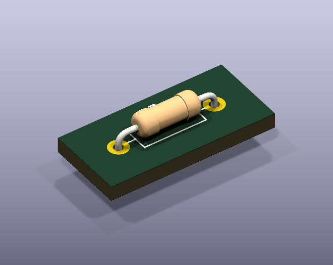 Modelo 3D (KiCad)</td><td align="center">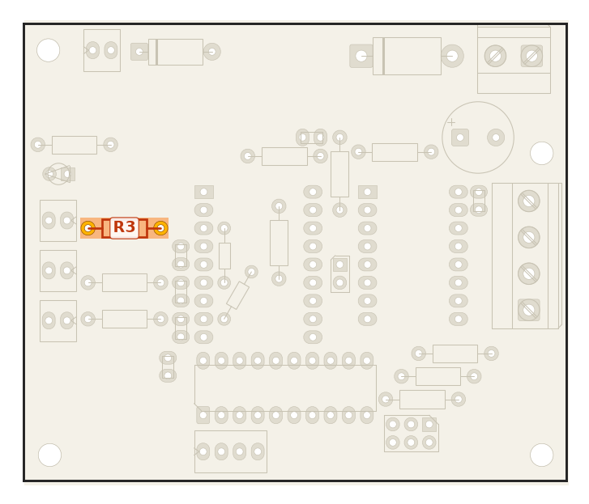 Onde fica</td></tr></table>

Pull-up do NTC. Tem que ser 100k (é o `pullup_resistor` do cfg).

### Resistor 47 kΩ

| Qtd | Referências | Valor | Comprar |
|---|---|---|---|
| 1 | R9 | 47k | Resistor 1/4 W 5%, furos a 10,16 mm |

<table><tr><td align="center"> Foto</td><td align="center"> Modelo 3D (KiCad)</td><td align="center">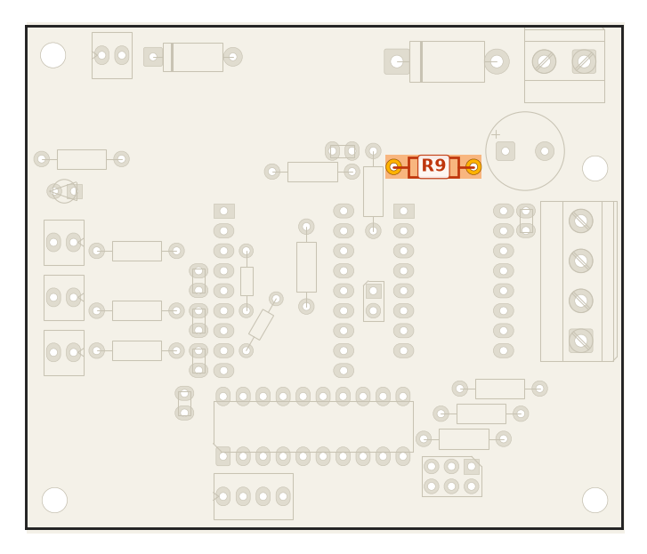 Onde fica</td></tr></table>

Parte de cima do divisor da 24 V.

### Resistor 5,6 kΩ

| Qtd | Referências | Valor | Comprar |
|---|---|---|---|
| 1 | R10 | 5k6 | Resistor 1/4 W 5%, furos a 10,16 mm |

<table><tr><td align="center"> Foto</td><td align="center">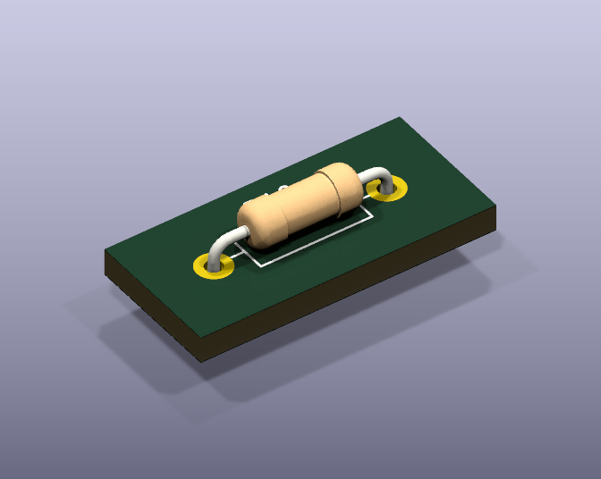 Modelo 3D (KiCad)</td><td align="center">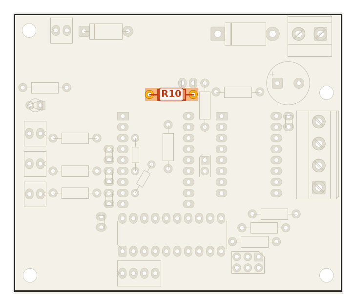 Onde fica</td></tr></table>

Parte de baixo do divisor. Fica embaixo do plugue USB.

### Borne 24 V (J5)

| Qtd | Referências | Valor | Comprar |
|---|---|---|---|
| 1 | J5 | 24V | Borne de parafuso 2 vias, passo 5,08 mm (KF301-2P / MKDS 1,5) |

<table><tr><td align="center">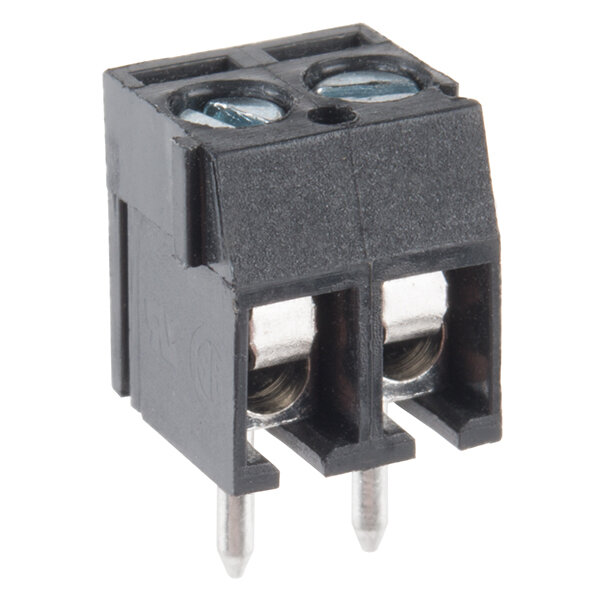 Foto (ilustrativa)</td><td align="center">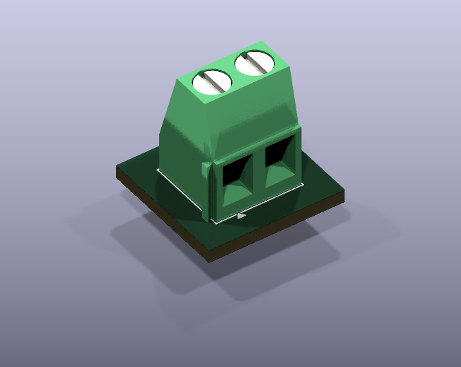 Modelo 3D (KiCad)</td><td align="center"> Onde fica</td></tr></table>

Entrada do fio para **cima**. +24 V à esquerda, GND à direita. A foto é de um borne de 3,5 mm; o de 5,08 mm é maior.

### Borne do motor (J6)

| Qtd | Referências | Valor | Comprar |
|---|---|---|---|
| 1 | J6 | MOTOR | Borne de parafuso 4 vias, passo 5,08 mm (KF301-4P ou 2 × KF301-2P) |

<table><tr><td align="center"> Foto (ilustrativa)</td><td align="center">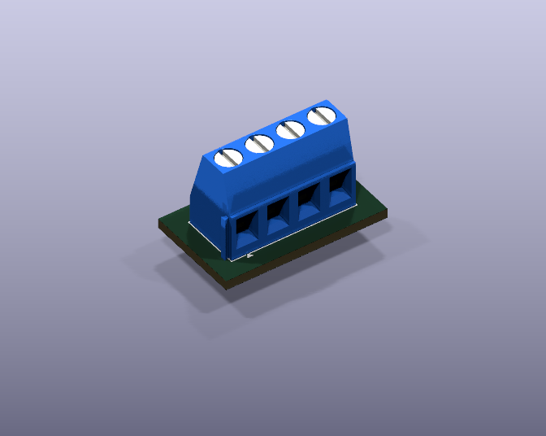 Modelo 3D (KiCad)</td><td align="center"> Onde fica</td></tr></table>

Entrada do fio para a **direita**. De cima para baixo: 2B, 2A, 1A, 1B.

### Conector DM556 (J4)

| Qtd | Referências | Valor | Comprar |
|---|---|---|---|
| 1 | J4 | DM556 | KF2510 4 vias 2,54 mm (macho de placa + fêmea + 4 terminais) |

<table><tr><td align="center">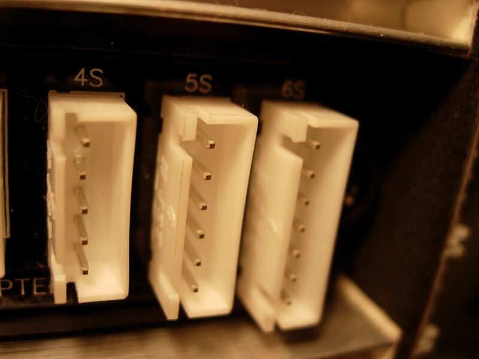 Foto (ilustrativa)</td><td align="center">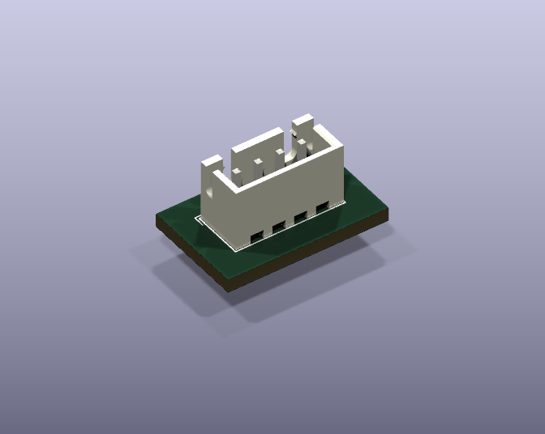 Modelo 3D (KiCad)</td><td align="center"> Onde fica</td></tr></table>

Da esquerda para a direita: 5V, PUL−, DIR−, ENA−. Trava para o lado da serigrafia. A foto mostra conectores JST XH, compatíveis com o KF2510.

### Conector NTC (J3)

| Qtd | Referências | Valor | Comprar |
|---|---|---|---|
| 1 | J3 | NTC | KF2510 2 vias 2,54 mm |

<table><tr><td align="center"> Foto (ilustrativa)</td><td align="center"> Modelo 3D (KiCad)</td><td align="center"> Onde fica</td></tr></table>

Sinal à direita, GND à esquerda. O NTC não tem polaridade.

### Conectores dos fins de curso (J1, J2)

| Qtd | Referências | Valor | Comprar |
|---|---|---|---|
| 2 | J1 J2 | FIM1, FIM2 | KF2510 2 vias 2,54 mm |

<table><tr><td align="center"> Foto (ilustrativa)</td><td align="center"> Modelo 3D (KiCad)</td><td align="center"> Onde fica</td></tr></table>

Sinal à direita, GND à esquerda. A chave fecha o pino para o GND.

### Conector da ventoinha (J7)

| Qtd | Referências | Valor | Comprar |
|---|---|---|---|
| 1 | J7 | FAN 24V | KF2510 2 vias 2,54 mm |

<table><tr><td align="center"> Foto (ilustrativa)</td><td align="center">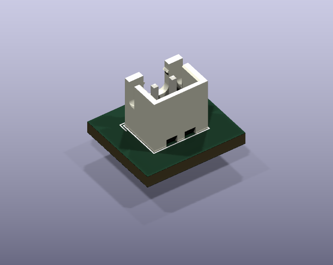 Modelo 3D (KiCad)</td><td align="center"> Onde fica</td></tr></table>

+24 V à esquerda, GND à direita. Sempre ligada.

### Header de micropasso (ZM)

| Qtd | Referências | Valor | Comprar |
|---|---|---|---|
| 1 | ZM | MICROPASSO | Barra de pinos macho 2x3 2,54 mm + 3 jumpers |

<table><tr><td align="center">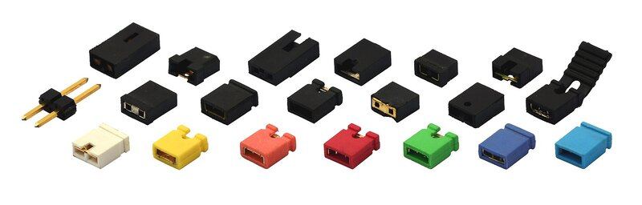 Foto</td><td align="center">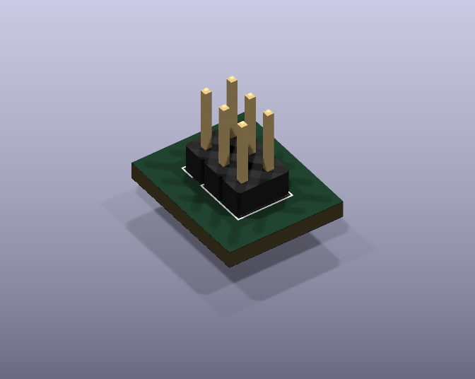 Modelo 3D (KiCad)</td><td align="center"> Onde fica</td></tr></table>

Serigrafia: MS3 MS2 MS1, "jumper = 0". Na primeira ligação, deixe **sem jumper** (1/16).

### Header de UART (JU)

| Qtd | Referências | Valor | Comprar |
|---|---|---|---|
| 1 | JU | UART | Barra de pinos macho 1x2 2,54 mm + 1 jumper |

<table><tr><td align="center"> Foto</td><td align="center">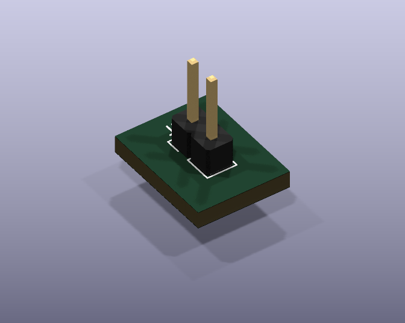 Modelo 3D (KiCad)</td><td align="center">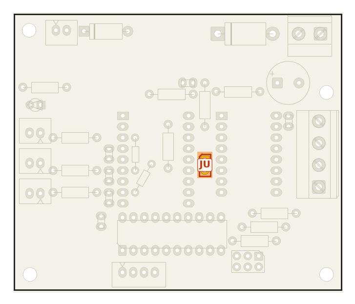 Onde fica</td></tr></table>

Aberto na primeira ligação. Fechado = UART do TMC2209 no GP5 (ver [capítulo 5](05-conectores-e-jumpers.md#ju--uart-do-tmc2209)).

### Jumper de fio de GND (JP1)

| Qtd | Referências | Valor | Comprar |
|---|---|---|---|
| 1 | JP1 | fio | Pedaço de fio rígido (perna de resistor cortada serve) |

<table><tr><td align="center"> Onde fica</td></tr></table>

⚠️ **Obrigatório.** Fio reto entre os dois furos (5,08 mm), do lado das peças. Leva o GND à coluna do NTC e dos fins de curso, por cima da trilha de 5 V. Sem ele, NTC e chaves ficam sem terra.

### Fixação (H1–H4)

| Qtd | Referências | Valor | Comprar |
|---|---|---|---|
| 4 | H1 H2 H3 H4 | M3 | Parafuso M3 + espaçador |

<table><tr><td align="center">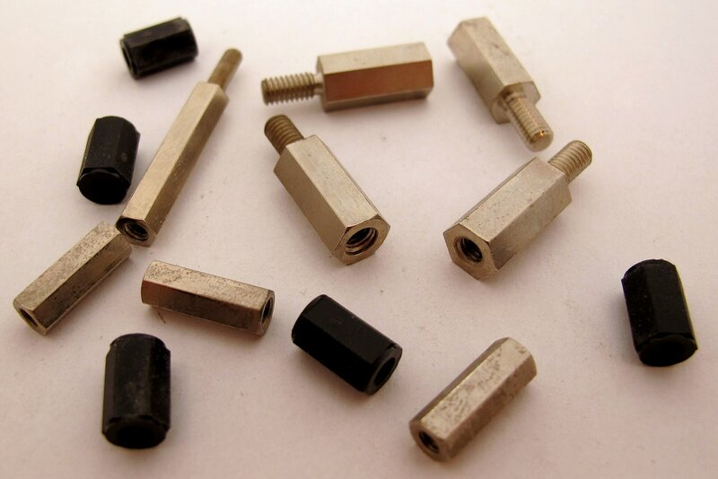 Foto</td><td align="center">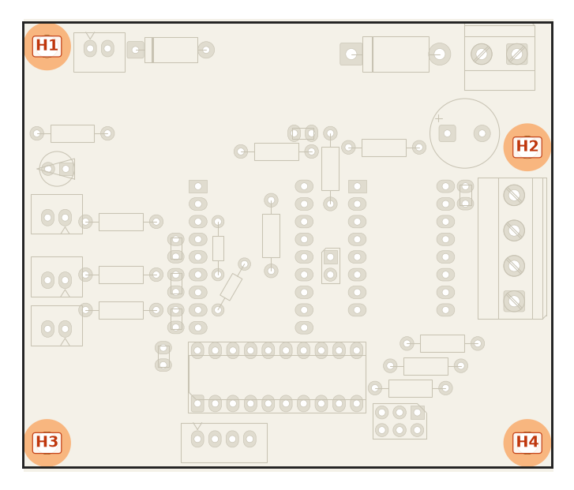 Onde fica</td></tr></table>

Furos de 3,2 mm nos cantos. A cabeça do parafuso do H2 fica a ~1 mm do C10.

