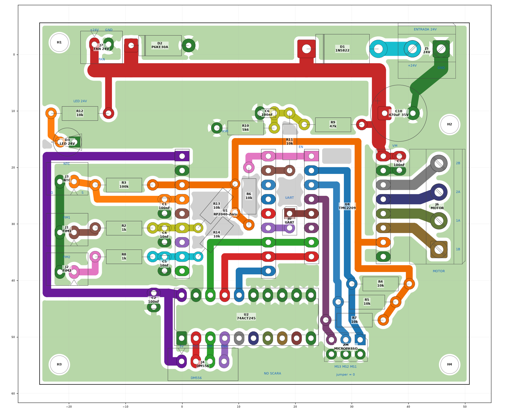
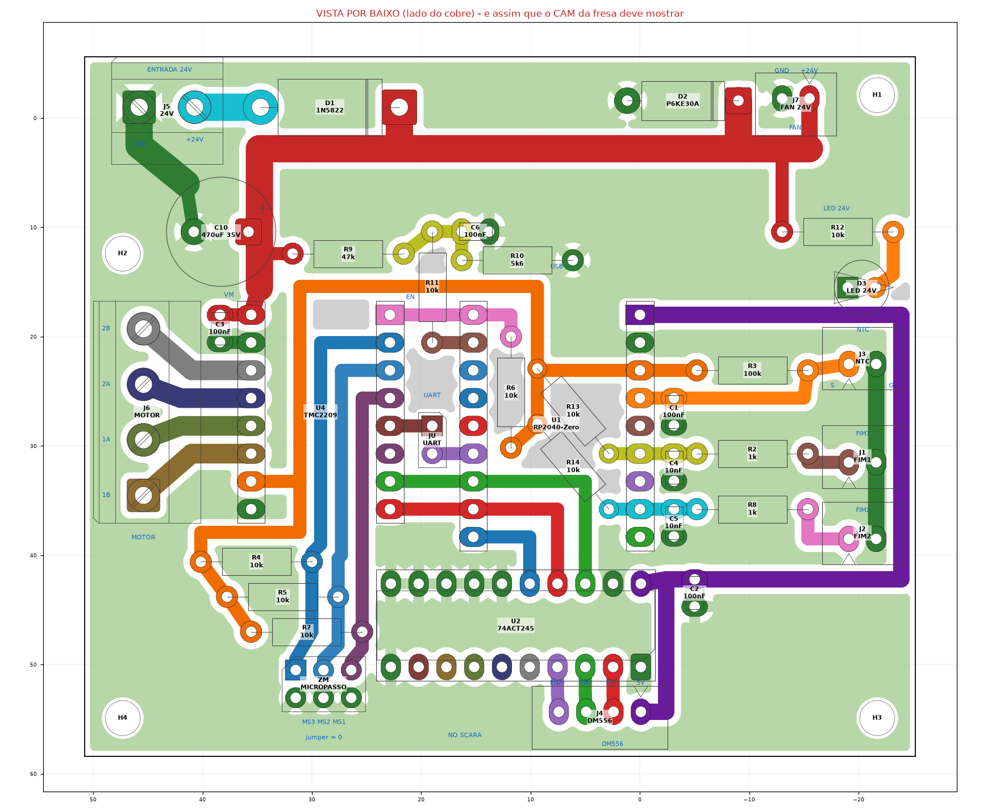

# 3. Fabricação (fresa CNC)

A placa é de **face única**: todo o cobre fica embaixo (B.Cu), e as peças vão do lado de cima, sem cobre.
As regras foram escolhidas para uma fresa de desempenho desconhecido, então valem para praticamente
qualquer CNC caseira.

## Regras do desenho

| Regra | Valor |
|---|---|
| Isolação entre cobres (vão) | **0,60 mm** em todo lugar (mínimo medido: 0,601 mm) |
| Trilhas | sinal 1,2 · 3,3 V 1,2 · 5 V 1,5 · motor 1,8 · 24 V e GND de potência 2,5 mm |
| Ilhas | soquetes e headers ovais 2,6 × 1,8 · resistores 2,0 · capacitores 1,8 × 2,4 · bornes 3,0 · C10 2,4 mm |
| Anel de cobre em volta do furo | mínimo **0,40 mm** em todos os furos |
| Cobre até a borda | 0,5 mm |
| Plano de GND | preenche o que sobra. Ilhas soltas ficam, porque sobra menos cobre para a fresa tirar. Alívio térmico em X nos pads de GND. |

<p align="center"></p>
<p align="center"><em>Face de cobre vista de cima (através da placa). Verde = GND ligado, cinza = ilha solta, cores = redes.</em></p>

## Ferramentas

| Etapa | Ferramenta | Observação |
|---|---|---|
| Isolação | V-bit 20–30° com ponta de 0,1–0,2 mm, ou fresa reta de 0,4–0,6 mm | Acima de 0,6 mm não passa entre ilhas vizinhas. Com 0,4 mm, faça 2 passadas. |
| Furos finos | broca **1,0 mm** de metal duro | **118 furos**: R, C, DIP, LED, D2, soquetes, JST XH, headers, C10 |
| Furos grossos | broca **1,6 mm** | **8 furos**: D1 (2), borne J5 (2) e borne J6 (4) |
| Contorno e M3 | fresa reta de 1,5–2,0 mm | Contorno em 3–4 passadas. Os 4 furos de 3,2 mm saem com essa fresa (mill holes). |

A placa usa só **duas brocas**. Os furos foram agrupados na v13, e as ilhas cresceram onde foi preciso
para manter o anel de 0,4 mm.

**Folgas:**
- A peça mais justa é a **barra fêmea** (pino de 0,64 mm quadrado em furo de 1,0 mm). Os furos precisam
  estar bem posicionados: fure uma fileira de 9 e teste a barra antes de fazer o resto.
- A peça mais folgada é o **borne** (pino de 1,0 × 0,8 mm em furo de 1,6 mm). O corpo assenta na placa e a
  ilha de 3,0 mm segura.

## Arquivos de produção

Já gerados em [`production/gerber/`](../production/gerber/):

| Arquivo | Conteúdo |
|---|---|
| `ScaraNode-B_Cu.gbl` | cobre (face única), **visto por cima**, através da placa |
| `ScaraNode-Edge_Cuts.gm1` | contorno 76 × 64 mm |
| `ScaraNode.drl` | furação Excellon: mm, absoluto, decimal, mesma origem do Gerber |
| `ScaraNode-drl_map.pdf` | mapa de furos por diâmetro |
| `ScaraNode-B_Cu-ESPELHADO.pdf` / `.png` | cobre já espelhado: como a placa fica olhando o lado do cobre |
| `ScaraNode-F_Silkscreen.gto` | serigrafia do lado das peças (só para conferência, não fresa) |

Para regerar depois de editar a placa no KiCad:

```sh
PCB=hardware/ScaraNode.kicad_pcb; OUT=production/gerber
kicad-cli pcb export gerbers --layers B.Cu,Edge.Cuts,F.SilkS --no-x2 --no-netlist \
    --use-drill-file-origin -o $OUT/ $PCB
kicad-cli pcb export drill --format excellon --excellon-units mm --excellon-zeros-format decimal \
    --drill-origin absolute --generate-map --map-format pdf -o $OUT/ $PCB
kicad-cli pcb export pdf --layers B.Cu,Edge.Cuts --mirror -o $OUT/ScaraNode-B_Cu-ESPELHADO.pdf $PCB
```

## Desenho mecânico

Placa **76 × 64 mm**. Furos M3 de **3,2 mm**, com centro a 3,5 mm das bordas. Origem no canto **inferior
esquerdo** da vista de cima (Y para cima, como no CAD):

| Furo | X (mm) | Y (mm) | Posição |
|---|---|---|---|
| H3 | 3,5 | 3,5 | inferior esquerdo |
| H4 | 72,5 | 3,5 | inferior direito |
| H1 | 3,5 | 60,5 | superior esquerdo |
| H2 | 72,5 | 46,0 | direita, 18 mm abaixo da borda de cima (o canto é do borne J5) |

- H1, H3 e H4 formam um retângulo de **69 × 57 mm** entre centros.
- H2 fica na mesma coluna do H4, a **42,5 mm** dele e a **14,5 mm** abaixo da linha do H1.
- DXF para a caixa ou o suporte: [`production/ScaraNode-mecanico.dxf`](../production/ScaraNode-mecanico.dxf)
  (camadas `CONTORNO`, `FUROS`, `CENTRO`, `COTAS`; mm).

## ⚠️ Espelhamento: o erro que inutiliza a placa

O Gerber da face de baixo é desenhado **visto por cima**. Se você fresa com o cobre virado para cima, o
CAM (no FlatCAM: *Mirror*, eixo Y) tem que mostrar a placa **igual à imagem abaixo**:

- borne de 24 V (J5) e borne do motor (J6) à **esquerda**
- NTC e fins de curso à **direita**
- USB do RP2040-Zero **em cima**

<p align="center"></p>

Se o CAM mostrar a placa igual à [vista de cima](#regras-do-desenho), o espelhamento está errado e
nenhum módulo vai encaixar.

## Conferência depois de fresar

1. Com o multímetro em continuidade, confira que nenhuma trilha vizinha está em curto, principalmente
   entre as fileiras dos soquetes e perto das ilhas de GND.
2. Encaixe a barra fêmea de 9 pinos nos furos do RP2040-Zero antes de soldar qualquer peça.
3. Compare a placa com a `ScaraNode-B_Cu-ESPELHADO.png`, olhando pelo lado do cobre.
