# 4. Montagem

Peças do lado **sem cobre**, solda do lado do cobre. Monte **da peça mais baixa para a mais alta**: assim a
placa apoia plana na bancada a cada etapa.

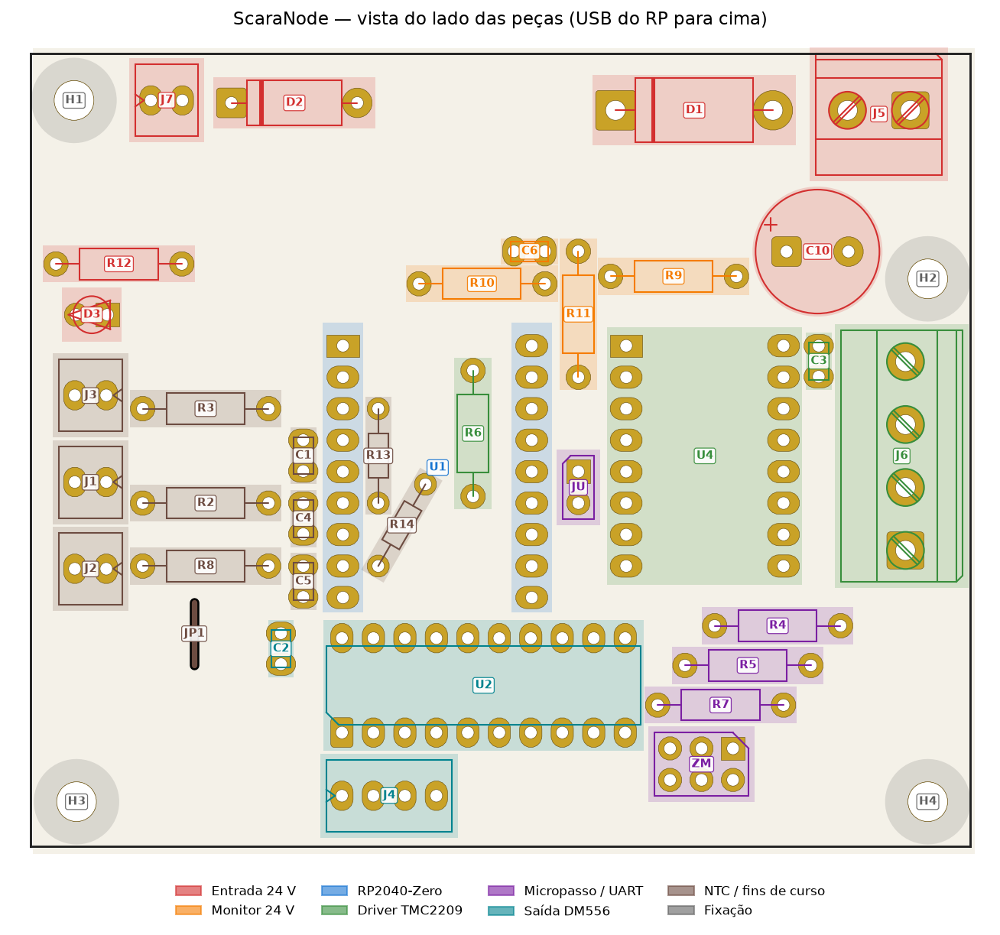

## Antes de começar

- Placa fresada e conferida ([capítulo 3](03-fabricacao.md#conferência-depois-de-fresar)).
- Teste o encaixe: uma barra fêmea de 9 pinos nos furos do RP2040-Zero e o borne nos furos de 1,6 mm.
- Ferro de 30–60 W, estanho 0,8 mm com fluxo, alicate de corte rente.
- Separe as peças pelo [BOM](02-lista-de-materiais.md) e confira os valores dos resistores com o multímetro.

## Sequência

| Passo | Peça | Onde | Cuidado |
|:-:|---|:-:|---|
| 1 | **JP1** (fio de GND) | 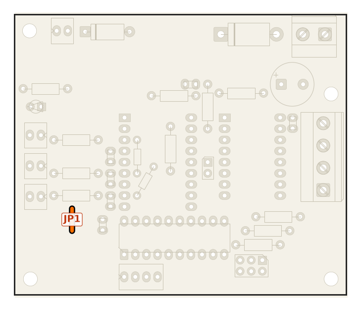 | Fio reto entre os dois furos, do lado das peças. ⚠️ Obrigatório. |
| 2 | **R13, R14** (10k 1/8 W) | 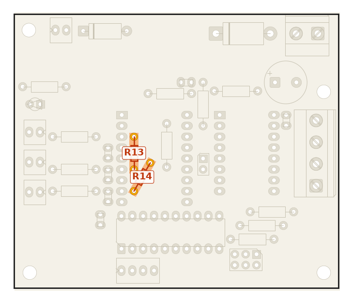 | Ficam **embaixo do RP2040-Zero**: têm que entrar antes da barra fêmea. R14 inclinado 60°, corpo por cima da trilha STP. |
| 3 | **R6** (10k) | 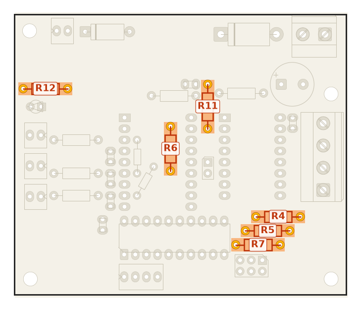 | Também fica embaixo do RP. Aproveite e monte os outros 10k (R4, R5, R7, R11, R12). |
| 4 | **Demais resistores** | 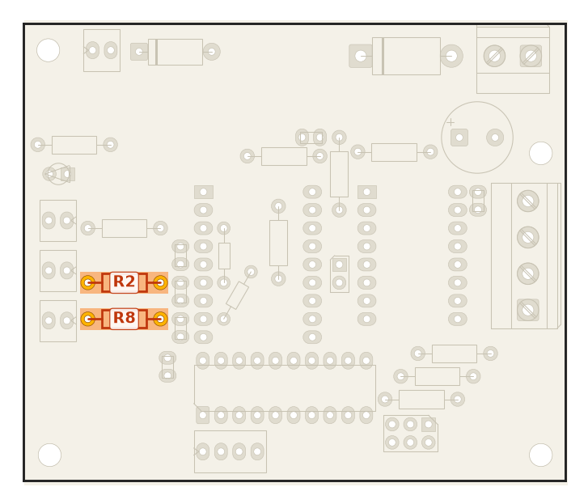 | R2, R8 (1k) · R3 (100k) · R9 (47k) · R10 (5k6). Todos deitados, sem polaridade. |
| 5 | **D1** 1N5822 | 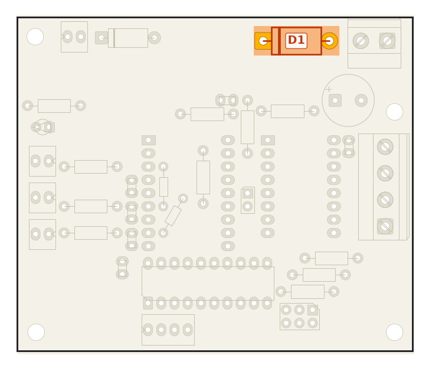 | ⚠️ Faixa do catodo para a **esquerda** (ilha quadrada). |
| 6 | **D2** P6KE30A | 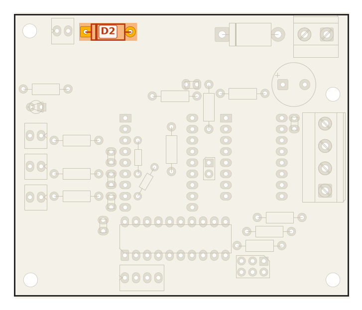 | ⚠️ Faixa do catodo para a **esquerda** (ilha quadrada). |
| 7 | **Cerâmicos** C1–C6 | 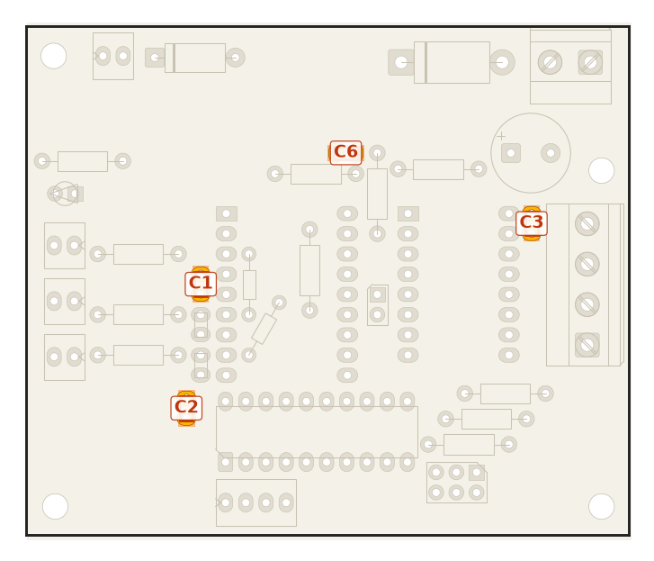 | Sem polaridade. 100 nF: C1, C2, C3, C6 · 10 nF: C4, C5. |
| 8 | **Soquete DIP-20** (ou U2 direto) | 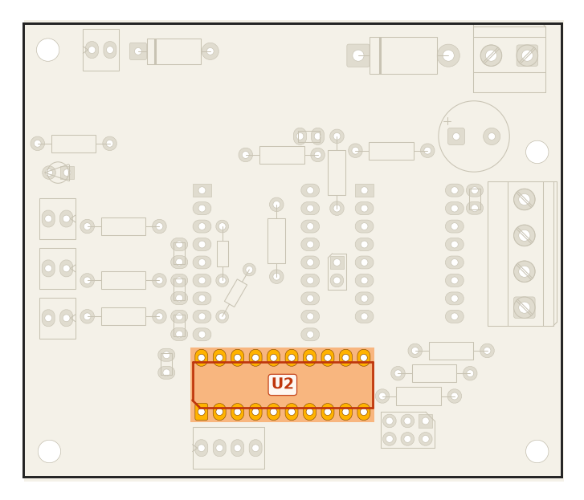 | Chanfro/pino 1 para a **esquerda**. |
| 9 | **Barras fêmea** do RP (2 × 1x9) e do TMC (2 × 1x8) | 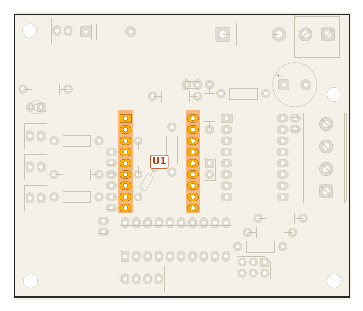 | Encaixe o módulo nas barras **antes** de soldar, para as fileiras ficarem paralelas. Solde as pontas, confira o prumo e depois o resto. |
| 10 | **ZM** (2x3) e **JU** (1x2) | 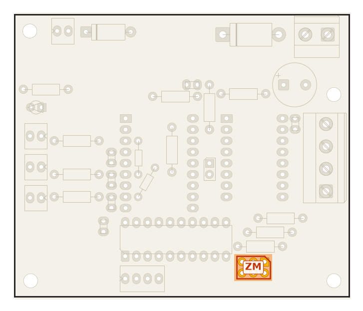 | Pinos curtos para baixo. Sem jumpers por enquanto. |
| 11 | **LED D3** | 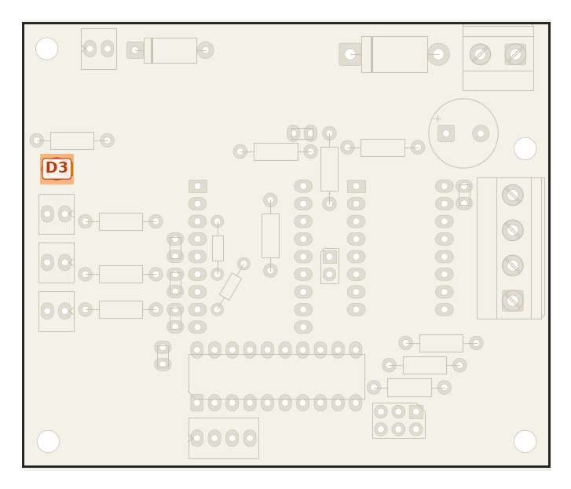 | Perna curta (catodo, lado chato) na ilha **quadrada**, à direita. |
| 12 | **KK** J1, J2, J3, J4, J7 |  | Trava para o lado marcado na serigrafia. |
| 13 | **C10** 470 µF | 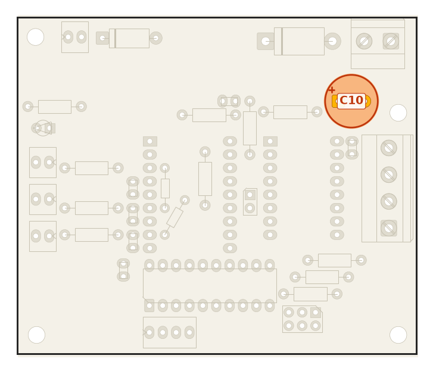 | ⚠️ Perna longa (+) na ilha **quadrada**, à esquerda. Assente bem: fica a ~1 mm da cabeça do M3 do H2 e a ~0,5 mm do borne J5. |
| 14 | **Bornes** J5 e J6 |  | J5: entrada de fio para **cima**. J6: entrada para a **direita**. Confira com o borne na mão antes de soldar. |
| 15 | **74ACT245** no soquete |  | Chanfro para a esquerda. Endireite as pernas na bancada antes. |
| 16 | **Módulos** (só depois da [conferência](#conferência-antes-de-energizar)) | 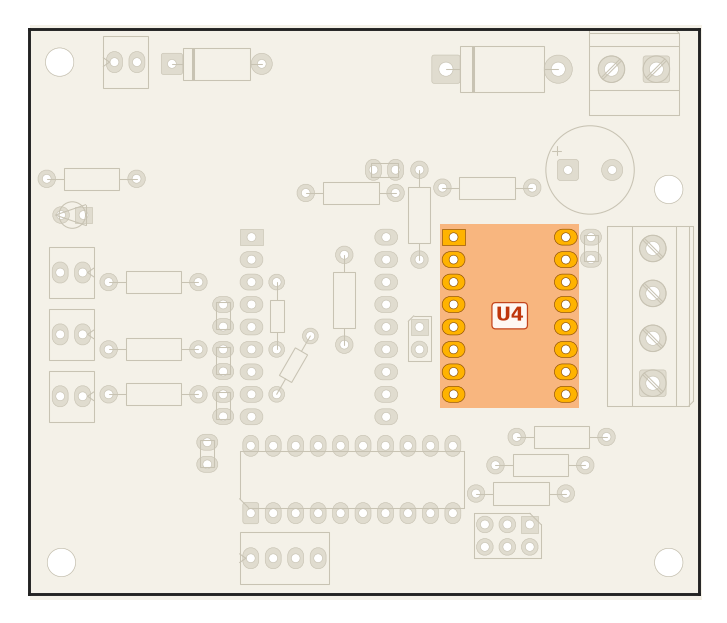 | RP2040-Zero com USB para cima. TMC2209 com EN no canto EN e VM no canto VM. |

## Alturas e interferências

- **Embaixo do plugue USB-C** do RP só há peças deitadas (C6, R10, R11), com menos de 3 mm de altura.
- O RP2040-Zero fica a ~8,5 mm da placa, em cima da barra fêmea; R6, R13 e R14 ficam embaixo dele.
- **C10** (Ø10 mm) encaixa entre o borne J5 e o furo H2 sem folga para inclinar.

## Polaridades: resumo

| Peça | Marca na peça | Ilha quadrada | Lado |
|---|---|---|---|
| D1 1N5822 | faixa = catodo | catodo | esquerda |
| D2 P6KE30A | faixa = catodo | catodo | esquerda |
| D3 LED | lado chato / perna curta = catodo | catodo | direita |
| C10 | faixa (−); perna longa (+) | **+** | esquerda |
| U2 74ACT245 | chanfro / ponto = pino 1 | pino 1 (GND) | esquerda |
| RP2040-Zero | USB-C | — | para cima |
| TMC2209 | serigrafia EN / VM do módulo | — | EN ao lado do GP0 |

## Conferência antes de energizar

Sem módulos, sem jumpers e com o C10 descarregado:

| Medida (multímetro) | Esperado |
|---|---|
| Continuidade +24 V × GND no J5 | **não pode apitar** (um bip curto é o C10 carregando) |
| 5V × GND e 3V3 × GND no soquete do RP | **não pode apitar** |
| Pino EN do soquete do TMC × 3V3 | ~10 kΩ (R6) |
| GP27 × 3V3 e GP15 × 3V3 no soquete do RP | ~10 kΩ (R13, R14) |
| GND do J3/J1/J2 × GND do J5 | continuidade (confirma o JP1) |
| Pino 1 × pino 20 do soquete do U2 | não pode apitar |

No módulo TMC2209, **antes** de fechar o JU: confirme com o multímetro que o pino 5 é o PDN_UART e se o
pino 4 está em curto com ele (se estiver, o jumper MS3 do ZM fica **sempre aberto**).

Próximo passo: [8. Primeira ligação e testes](08-testes.md).
