# 4. Montagem

Peças do lado **sem cobre**, solda do lado do cobre. Monte **da peça mais baixa para a mais alta**: assim a
placa apoia plana na bancada a cada etapa.

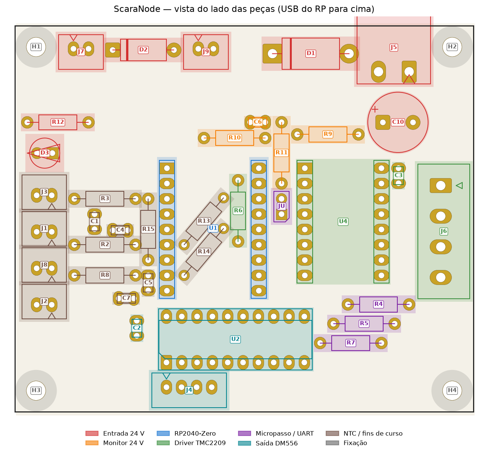

## Antes de começar

- Placa fresada e conferida ([capítulo 3](03-fabricacao.md#conferência-depois-de-fresar)).
- Teste o encaixe: uma barra fêmea de 9 pinos nos furos do RP2040-Zero e o conector 2EDG nos furos de 1,6 mm.
- Ferro de 30–60 W, estanho 0,8 mm com fluxo, alicate de corte rente.
- Separe as peças pelo [BOM](02-lista-de-materiais.md) e confira os valores dos resistores com o multímetro.

## Sequência

| Passo | Peça | Onde | Cuidado |
|:-:|---|:-:|---|
| 1 | **R13, R14** (10k) | 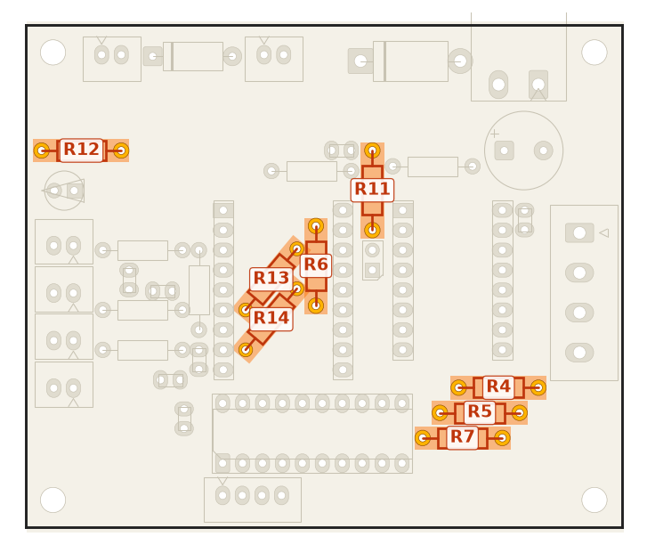 | Ficam **embaixo do RP2040-Zero**: têm que entrar antes da barra fêmea. R13 e R14 inclinados 50°, paralelos; o corpo do R14 passa por cima da trilha STP. |
| 2 | **R6** (10k) |  | Também fica embaixo do RP. Aproveite e monte os outros 10k (R4, R5, R7, R11, R12). |
| 3 | **Demais resistores** | 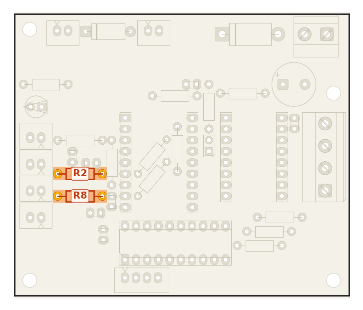 | R2, R8 (1k) · R3, R15 (100k) · R9 (47k) · R10 (5k6). Todos deitados, sem polaridade; o R15 fica na vertical, ao lado da barra fêmea da esquerda do RP. |
| 4 | **D1** 1N5822 | 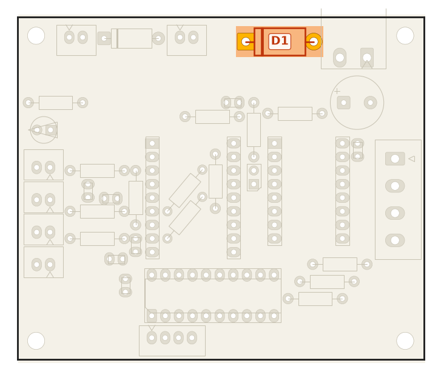 | ⚠️ Faixa do catodo para a **esquerda** (ilha quadrada). |
| 5 | **D2** P6KE30A | 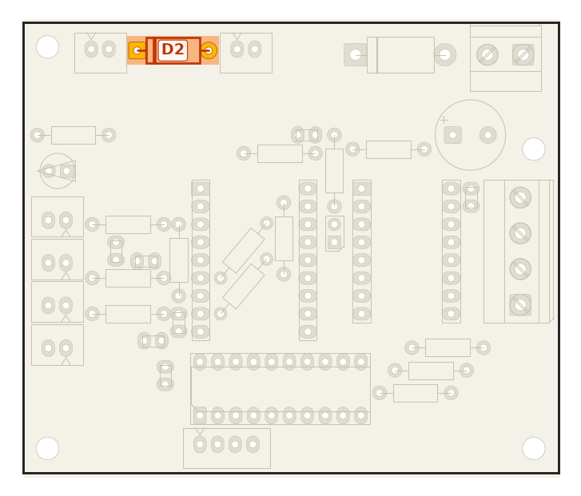 | ⚠️ Faixa do catodo para a **esquerda** (ilha quadrada). |
| 6 | **Cerâmicos** C1–C7 | 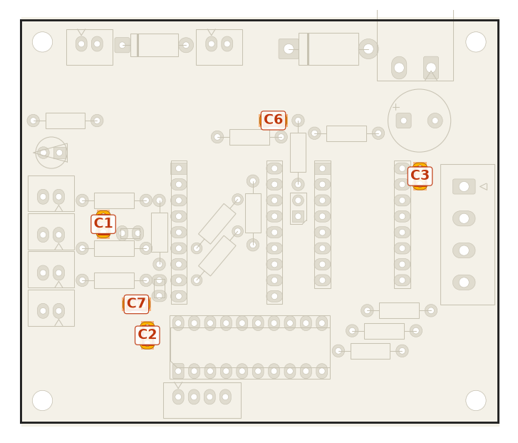 | Sem polaridade. 100 nF: C1, C2, C3, C6, C7 · 10 nF: C4, C5. |
| 7 | **Soquete DIP-20** do U2 | 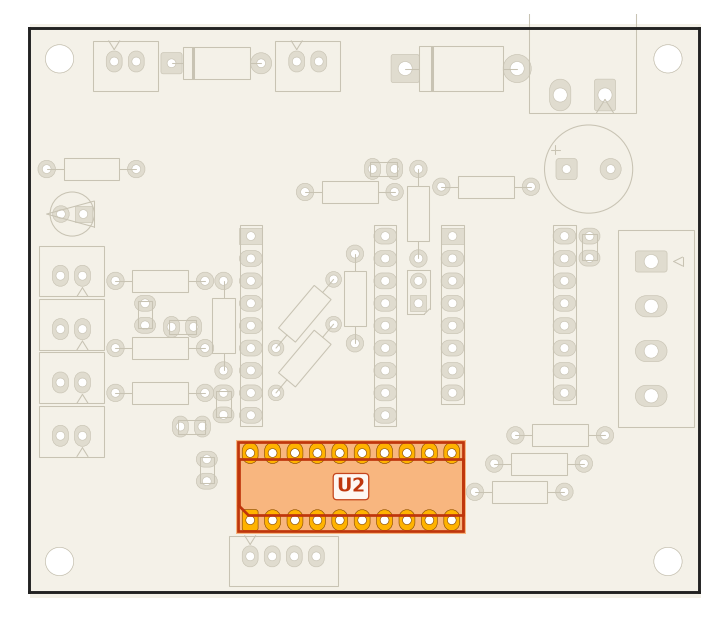 | Chanfro do soquete para a **esquerda** (lado do pino 1). Solde dois cantos, confira que assentou e depois o resto. O CI só entra no passo 14. |
| 8 | **Barras fêmea** do RP (2 × 1x9) e do TMC (2 × 1x8) | 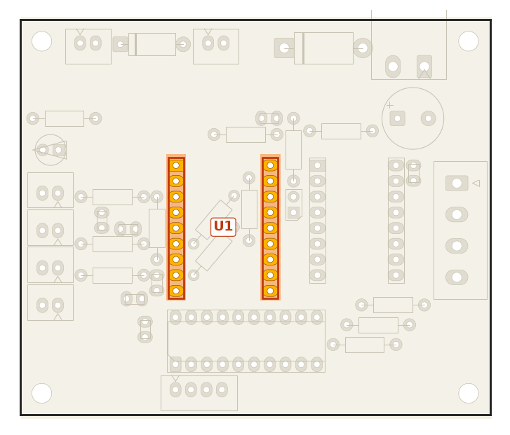 | Encaixe o módulo nas barras **antes** de soldar, para as fileiras ficarem paralelas. Solde as pontas, confira o prumo e depois o resto. |
| 9 | **JU** (1x2) | 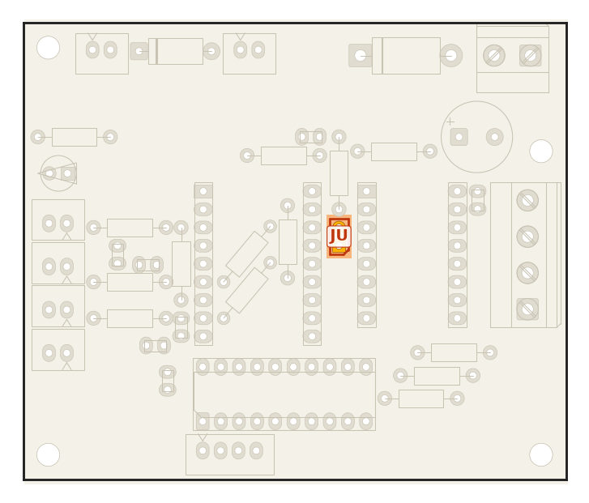 | Pinos curtos para baixo. Sem jumper por enquanto. |
| 10 | **LED D3** | 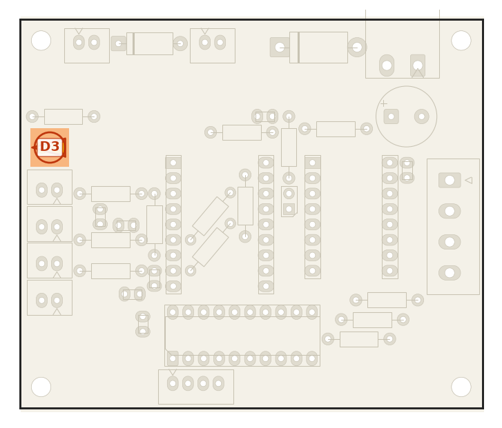 | Perna curta (catodo, lado chato) na ilha **quadrada**, à direita. |
| 11 | **JST XH** J1, J2, J3, J4, J7, J8, J9 |  | Corpo sobre o contorno da serigrafia. J1–J3 ficam a ~0,9 mm das pernas de R2/R3/R8. |
| 12 | **C10** 470 µF | 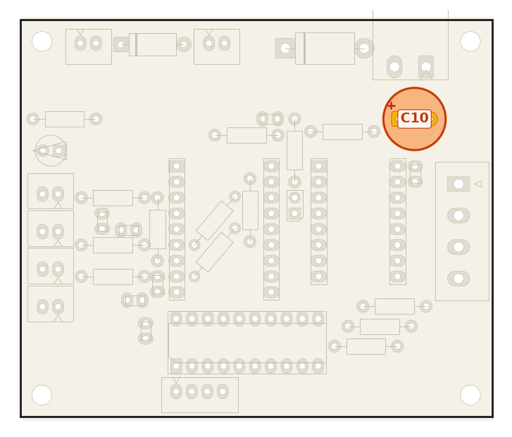 | ⚠️ Perna longa (+) na ilha **quadrada**, à esquerda. Assente bem: fica a ~0,8 mm da cabeça do M3 do H2 e a ~1,2 mm do borne J5. |
| 13 | **Conectores 2EDG** J5 e J6 |  | J5 (24 V, macho 90°): a abertura para a **borda de cima**. J6 (motor, macho vertical): parede alta para **dentro** da placa, o fio do plugue sai para a **direita**. Confira com o plugue encaixado antes de soldar. |
| 14 | **74ACT245** no soquete |  | Chanfro/ponto do pino 1 para a **esquerda**, igual ao soquete. Endireite as pernas na bancada antes. |
| 15 | **Módulos** (só depois da [conferência](#conferência-antes-de-energizar)) | 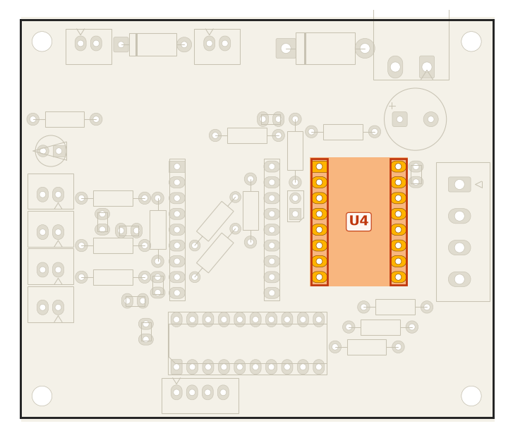 | RP2040-Zero com USB para cima. TMC2209 com EN no canto EN e VM no canto VM. |

## Alturas e interferências

- **Embaixo do plugue USB-C** do RP só há peças deitadas (C6, R10, R11), com menos de 3 mm de altura.
- O RP2040-Zero fica a ~8,5 mm da placa, em cima da barra fêmea; R6, R13 e R14 ficam embaixo dele.
- **C10** (Ø10 mm) fica a ~1,4 mm do corpo do J5: assente bem, sem inclinar.

## Polaridades: resumo

| Peça | Marca na peça | Ilha quadrada | Lado |
|---|---|---|---|
| D1 1N5822 | faixa = catodo | catodo | esquerda |
| D2 P6KE30A | faixa = catodo | catodo | esquerda |
| D3 LED | lado chato / perna curta = catodo | catodo | direita |
| C10 | faixa (−); perna longa (+) | **+** | esquerda |
| U2 74ACT245 | chanfro / ponto = pino 1 | pino 1 (GND) | esquerda |
| RP2040-Zero | USB-C | — | para cima |
| TMC2209 | serigrafia EN / VM do módulo | — | EN ao lado do GP0 |

## Conferência antes de energizar

Sem módulos, sem jumpers e com o C10 descarregado:

| Medida (multímetro) | Esperado |
|---|---|
| Continuidade +24 V × GND no J5 | **não pode apitar** (um bip curto é o C10 carregando) |
| 5V × GND e 3V3 × GND no soquete do RP | **não pode apitar** |
| Pino EN do soquete do TMC × 3V3 | ~10 kΩ (R6) |
| GP27 × 3V3 e GP15 × 3V3 no soquete do RP | ~10 kΩ (R13, R14) |
| GND do J3/J1/J8/J2 × GND do J5 | continuidade |
| Pino 1 × pino 20 do soquete do U2 (GND × 5V) | não pode apitar |

No módulo TMC2209, **antes** de fechar o JU: confirme com o multímetro ou na serigrafia que o pino 4 (posição do
MS3) é o PDN_UART. A placa liga a UART nesse pino desde a v18.

Próximo passo: [8. Primeira ligação e testes](08-testes.md).
