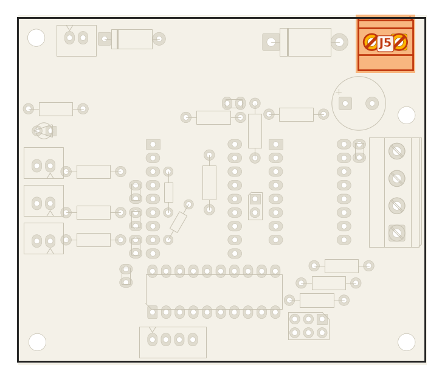
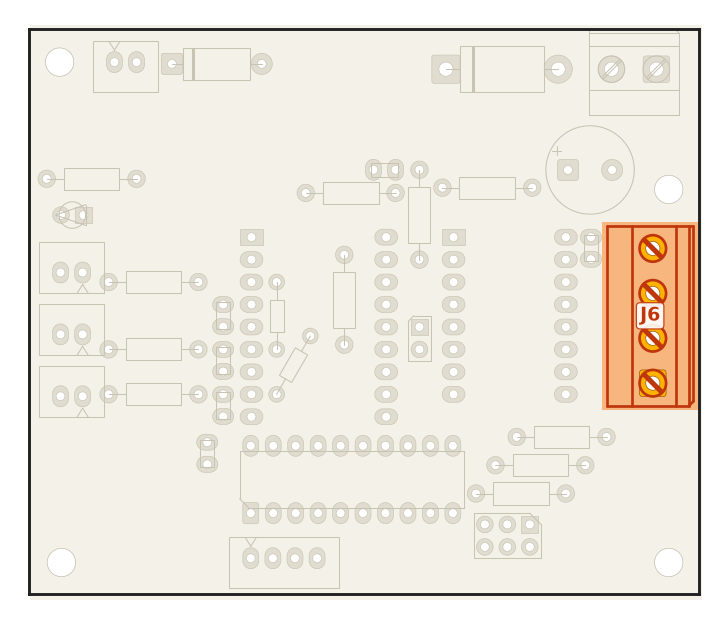
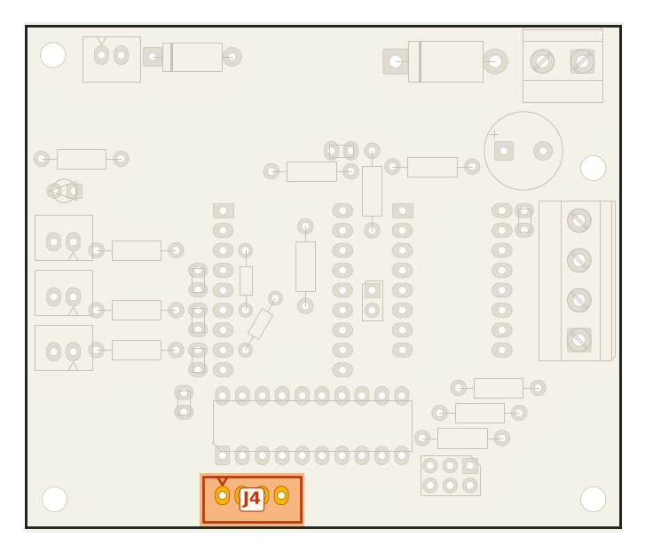
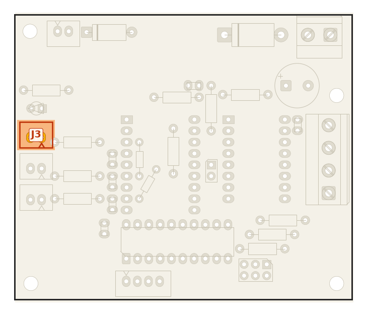
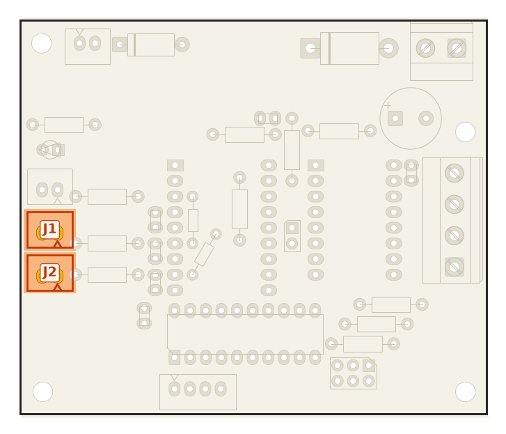
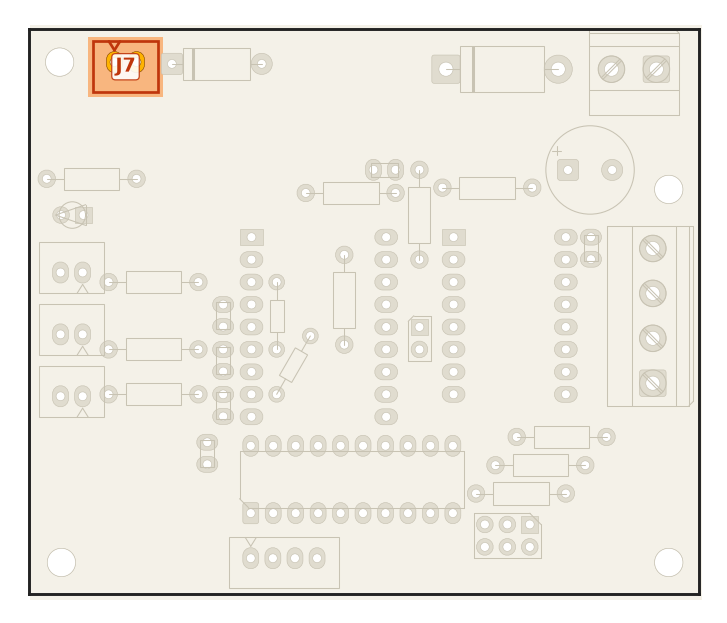

# 5. Conectores, pinagem e jumpers

Todas as posições abaixo são na **vista de cima** (lado das peças, USB do RP para cima).

## Pinagem do RP2040-Zero

Coluna esquerda, de cima para baixo: `5V, GND, 3V3, GP29, GP28, GP27, GP26, GP15, GP14`.
Coluna direita, de cima para baixo: `GP0 … GP8`. Os pinos castelados de baixo (GP9–GP13) não são usados.

| Pino | Rede | Função | No `printer.cfg` |
|---|---|---|---|
| 5V | `5V` | Vem do USB; alimenta o 74ACT245 e o PUL+/DIR+/ENA+ do DM556 | — |
| GND | `GND` | Terra comum (USB, 24 V, sensores) | — |
| 3V3 | `3V3` | Regulador do módulo; alimenta o VDD do TMC, os pull-ups e o NTC | — |
| GP0 | `EN` | Enable do TMC2209 (ativo baixo, pull-up R6) | `enable_pin: !gpio0` |
| GP1 | `VSENSE` | Monitor da 24 V (~2,5 V com 24 V) | `[gcode_button] pin: gpio1` |
| GP5 | `UART` | PDN_UART do TMC2209, via jumper JU | `uart_pin: gpio5` |
| GP6 | `STP` | STEP para o TMC e para o 74ACT245 | `step_pin: gpio6` (`!gpio6` no DM556) |
| GP7 | `DIR` | DIR para o TMC e para o 74ACT245 | `dir_pin: gpio7` |
| GP8 | `ENA` | ENA do DM556 via 74ACT245 (alto = habilitado) | `enable_pin: gpio8` |
| GP15 | `SW2` | Fim de curso 2 (J2), pull-up 10k R14 | `endstop_pin: !gpio15` (NA) |
| GP27 | `SW1` | Fim de curso 1 (J1), pull-up 10k R13 | `endstop_pin: !gpio27` (NA) |
| GP29 | `NTC` | ADC3, NTC com pull-up de 100k | `sensor_pin: gpio29` |
| GP2, GP3, GP4 | livres | SPI (SCK, MOSI, MISO) para um ADXL345 por fio | `spi_software_*` |
| GP14, GP26, GP28 | livres | Sem trilha; servem de CS do ADXL345 | — |

## Conectores

| Conector | Pino (vista de cima) | Liga em | Observação |
|---|---|---|---|
| **J5** 24 V (borne verde) | esquerda: **+24 V** | +24 V da fonte (depois do relé/fusível) | Passa pelo D1; invertido, nada liga |
| | direita: **GND** | 0 V da fonte | Mesmo GND do USB: fonte e host no mesmo terra |
| **J6** MOTOR (borne azul) | de cima para baixo: **2B, 2A, 1A, 1B** | bobinas do NEMA 17 | Os dois de cima são uma bobina, os dois de baixo a outra. Trocar um par inverte o sentido (ou use `!` no `dir_pin`). |
| **J4** DM556 | 1 (esquerda): **5V** | PUL+, DIR+ e ENA+ do DM556 (juntos) | Ânodo comum. Sem resistor: o DM556 já limita para 5 V. |
| | 2: **PUL−** | PUL− do DM556 | Saída do 74ACT245 |
| | 3: **DIR−** | DIR− do DM556 | |
| | 4 (direita): **ENA−** | ENA− do DM556 | GP8 baixo (RP em reset) = motor desabilitado |
| **J3** NTC | direita: sinal · esquerda: GND | NTC 100k encostado no motor | Sem polaridade |
| **J1 / J2** FIM | direita: sinal · esquerda: GND | chave fim de curso | Fecha para GND. NA ou NF: ajuste com `!` no cfg |
| **J7** FAN | esquerda: +24 V · direita: GND | ventoinha 24 V | Sempre ligada |
| **USB-C** | — | host (Pi/PC) | Um cabo por nó. Identifique cada nó por `/dev/serial/by-id/` |

<table><tr>
<td align="center"> J5</td>
<td align="center"> J6</td>
<td align="center"> J4</td>
</tr><tr>
<td align="center"> J3</td>
<td align="center"> J1 / J2</td>
<td align="center"> J7</td>
</tr></table>

## Pinagem do soquete StepStick (U4)

| Pino | Função | Liga em | | Pino | Função | Liga em |
|---|---|---|---|---|---|---|
| 1 | EN | GP0 + R6 (pull-up) | | 16 | VMOT | 24 V (após D1) + C3 |
| 2 | MS1 | R4 + ZM | | 15 | GND | GND de potência |
| 3 | MS2 | R5 + ZM | | 14 | 2B | J6 |
| 4 | MS3 | R7 + ZM | | 13 | 2A | J6 |
| 5 | PDN_UART | JU → GP5 | | 12 | 1A | J6 |
| 6 | CLK | **livre** (clock interno) | | 11 | 1B | J6 |
| 7 | STEP | GP6 | | 10 | VDD | 3V3 |
| 8 | DIR | GP7 | | 9 | GND | GND |

O pino 6 fica livre de propósito: aterrar sem medir pode danificar módulos que usam esse pino para outra
coisa. A4988 e DRV8825 só funcionam com o curto RST–SLP feito no próprio módulo (os pinos 5 e 6 da placa
não estão mais livres para isso).

## Jumpers

### ZM — micropasso (modo standalone, JU aberto)

Sem jumper, o pino fica em 3,3 V pelo pull-up (= 1). Com jumper, vai para GND (= 0).
Serigrafia: `MS3 MS2 MS1`, "jumper = 0".

| MS1 | MS2 | Micropasso | `printer.cfg` |
|---|---|---|---|
| aberto (1) | aberto (1) | 1/16 | `microsteps: 16` (padrão do projeto) |
| fechado (0) | fechado (0) | 1/8 | `microsteps: 8` |
| aberto (1) | fechado (0) | 1/32 | `microsteps: 32` |
| fechado (0) | aberto (1) | 1/64 | `microsteps: 64` |

**MS3:** no TMC2209, esse pino do StepStick varia com o fabricante (SPREAD, PDN_UART ou nada).
⚠️ Deixe **aberto**. Se for SPREAD, aberto = spreadCycle. Se for PDN_UART, fechado aterra a UART.

### JU — UART do TMC2209

- **Aberto:** driver em standalone. Corrente pelo trimpot, micropasso pelo ZM.
- **Fechado:** GP5 ligado ao PDN_UART (pino 5 do StepStick). Com a seção `[tmc2209]` no cfg, o trimpot
  é ignorado, o micropasso vem do cfg, e MS1/MS2 viram o endereço da UART: os dois abertos = endereço 3,
  os dois fechados = 0. Sem a seção no cfg, o driver continua em standalone mesmo com o JU fechado.
- UART de 1 fio (half-duplex), sem resistor: o Klipper alterna a direção do GP5.

### JP1 — fio de GND

⚠️ **Não é opcional.** Pedaço de fio rígido soldado nos dois furos (5,08 mm), do lado das peças. Ele leva o
GND dos conectores da esquerda por cima da trilha de 5 V. Sem ele, NTC e fins de curso ficam sem terra.
