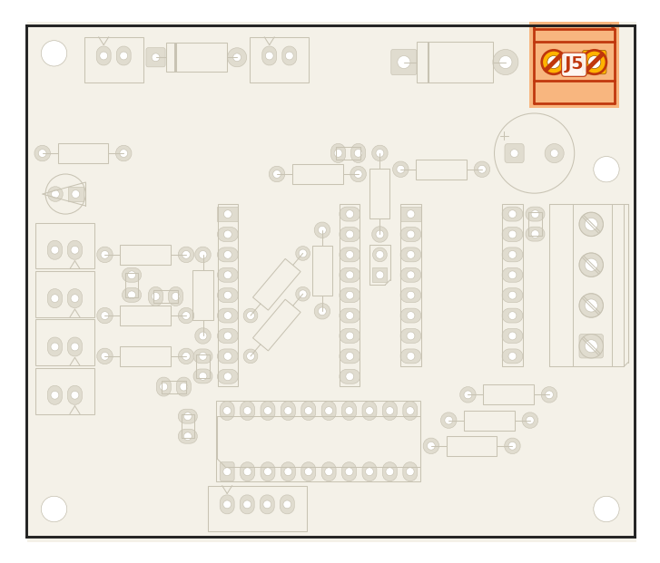
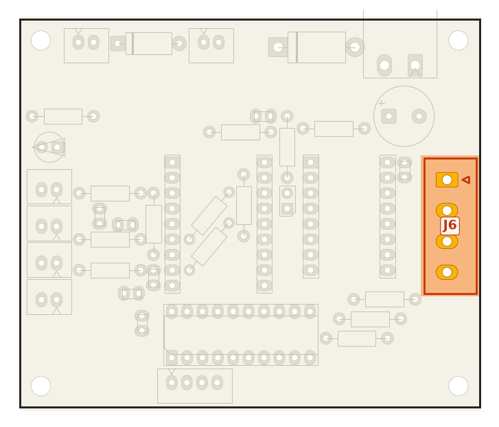
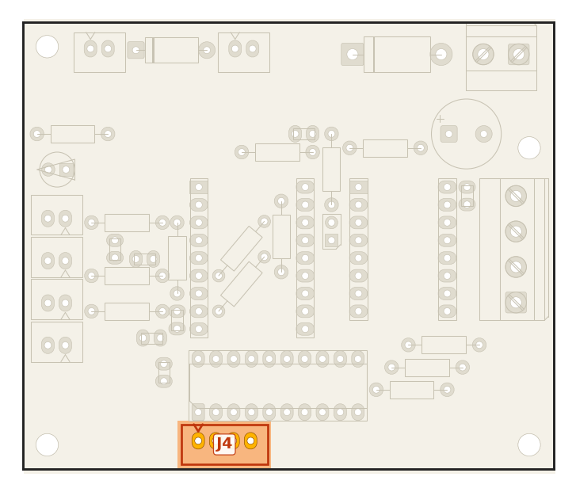
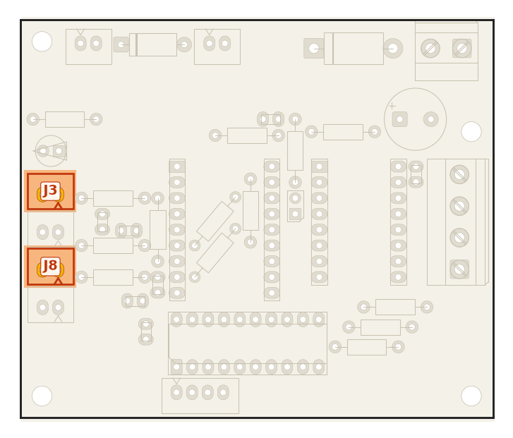
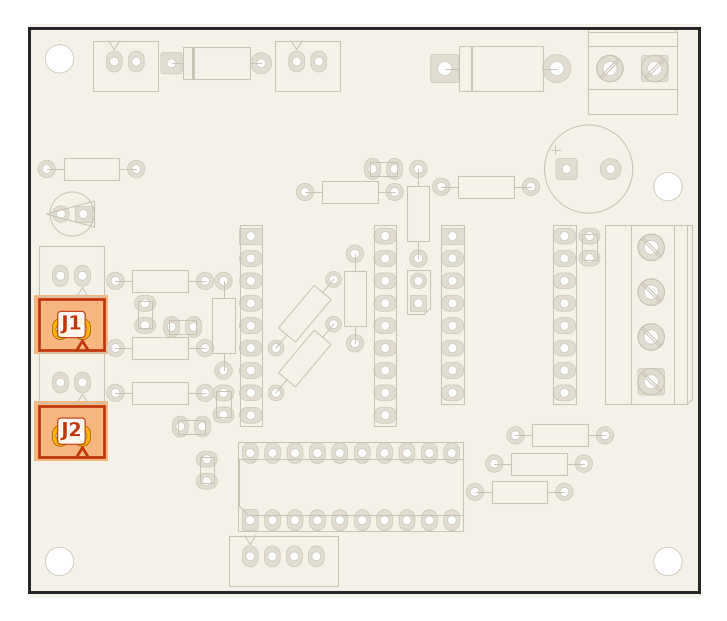
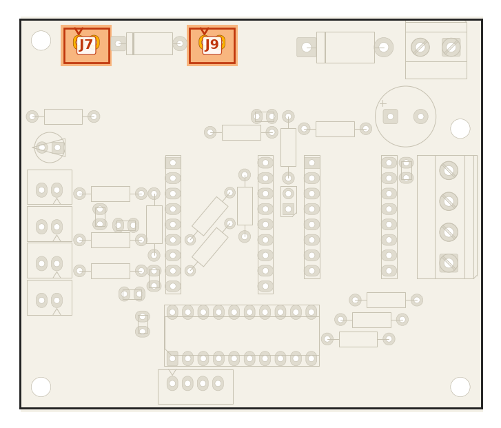

# 5. Conectores, pinagem e jumpers

Todas as posições abaixo são na **vista de cima** (lado das peças, USB do RP para cima).

## Pinagem do RP2040-Zero

Coluna esquerda, de cima para baixo: `5V, GND, 3V3, GP29, GP28, GP27, GP26, GP15, GP14`.
Coluna direita, de cima para baixo: `GP0 … GP8`. Os pinos castelados de baixo (GP9–GP13) não são usados.

| Pino | Rede | Função | No `printer.cfg` |
|---|---|---|---|
| 5V | `5V` | Vem do USB; alimenta o 74ACT245 e o PUL+/DIR+/ENA+ do DM556 | — |
| GND | `GND` | Terra comum (USB, 24 V, sensores) | — |
| 3V3 | `3V3` | Regulador do módulo; alimenta o VDD do TMC, os pull-ups e o NTC | — |
| GP0 | `EN` | Enable do TMC2209 (ativo baixo, pull-up R6) | `enable_pin: !gpio0` |
| GP1 | `VSENSE` | Monitor da 24 V (~2,5 V com 24 V) | `[gcode_button] pin: gpio1` |
| GP2 | `UART` | PDN_UART do TMC2209 (pino 4 do soquete), via jumper JU | `uart_pin: gpio2` |
| GP4 | `STP` | STEP do TMC2209 | `step_pin: gpio4` |
| GP5 | `DIR` | DIR do TMC2209 | `dir_pin: gpio5` |
| GP6 | `DM_STP` | PUL do DM556 via 74ACT245 | `step_pin: !gpio6` |
| GP7 | `DM_DIR` | DIR do DM556 via 74ACT245 | `dir_pin: gpio7` |
| GP8 | `ENA` | ENA do DM556 via 74ACT245 (alto = habilitado) | `enable_pin: gpio8` |
| GP15 | `SW2` | Fim de curso 2 (J2), pull-up 10k R14 | `endstop_pin: !gpio15` (NA) |
| GP27 | `SW1` | Fim de curso 1 (J1), pull-up 10k R13 | `endstop_pin: !gpio27` (NA) |
| GP26 | `NTC2` | ADC0, NTC2 (J8) com pull-up de 100k (R15) | `sensor_pin: gpio26` |
| GP29 | `NTC` | ADC3, NTC1 (J3) com pull-up de 100k (R3) | `sensor_pin: gpio29` |
| GP3, GP14, GP28 | livres | Sem trilha; acelerômetro I2C por fio (ver capítulo 6) | `i2c_software_*` |

**Dois canais independentes (v18):** o TMC2209 (GP4/GP5/GP0) e o DM556 (GP6/GP7/GP8) têm STEP, DIR e enable
próprios. Uma placa pode mover dois motores diferentes ao mesmo tempo, um em cada driver. Até a v17, o STEP e o DIR
iam juntos para os dois.

## Conectores

| Conector | Pino (vista de cima) | Liga em | Observação |
|---|---|---|---|
| **J5** 24 V (2EDG 90°, plugue pela borda de cima) | esquerda: **+24 V** | +24 V da fonte, por um fusível de 2 A **só desta placa** (ver [capítulo 6](06-circuitos.md#fusíveis-fora-da-placa)) | Passa pelo D1; invertido, nada liga |
| | direita: **GND** | 0 V da fonte | Mesmo GND do USB: fonte e host no mesmo terra |
| **J6** MOTOR (2EDG vertical, plugue por cima, fio para a direita) | de cima para baixo: **2B, 2A, 1A, 1B** | bobinas do NEMA 17 | Os dois de cima são uma bobina, os dois de baixo a outra. Trocar um par inverte o sentido (ou use `!` no `dir_pin`). |
| **J4** DM556 | 1 (esquerda): **5V** | PUL+, DIR+ e ENA+ do DM556 (juntos) | Ânodo comum. Sem resistor: o DM556 já limita para 5 V. |
| | 2: **PUL−** | PUL− do DM556 | Saída do 74ACT245 |
| | 3: **DIR−** | DIR− do DM556 | |
| | 4 (direita): **ENA−** | ENA− do DM556 | GP8 baixo (RP em reset) = motor desabilitado |
| **J3** NTC1 | direita: sinal · esquerda: GND | NTC 100k encostado no motor do TMC2209 | Sem polaridade |
| **J8** NTC2 | direita: sinal · esquerda: GND | NTC 100k encostado no motor do DM556 | Só com dois motores na placa |
| **J1 / J2** FIM | direita: sinal · esquerda: GND | chave fim de curso | Fecha para GND. NA ou NF: ajuste com `!` no cfg |
| **J7** FAN | esquerda: +24 V · direita: GND | ventoinha 24 V do TMC2209 | Sempre ligada |
| **J9** FAN2 | esquerda: +24 V · direita: GND | ventoinha 24 V do DM556 ou da caixa | Sempre ligada |
| **USB-C** | — | host (Pi/PC) | Um cabo por nó. Identifique cada nó por `/dev/serial/by-id/` |

<table><tr>
<td align="center"> J5</td>
<td align="center"> J6</td>
<td align="center"> J4</td>
</tr><tr>
<td align="center"> J3</td>
<td align="center"> J1 / J2</td>
<td align="center"> J7</td>
</tr></table>

## Pinagem do soquete StepStick (U4)

| Pino | Função | Liga em | | Pino | Função | Liga em |
|---|---|---|---|---|---|---|
| 1 | EN | GP0 + R6 (pull-up) | | 16 | VMOT | 24 V (após D1) + C3 |
| 2 | MS1 | R4 (pull-up) | | 15 | GND | GND de potência |
| 3 | MS2 | R5 (pull-up) | | 14 | 2B | J6 |
| 4 | PDN_UART | JU → GP2, pull-up R7 | | 13 | 2A | J6 |
| 5 | — | **livre** | | 12 | 1A | J6 |
| 6 | CLK | **livre** (clock interno) | | 11 | 1B | J6 |
| 7 | STEP | GP4 | | 10 | VDD | 3V3 |
| 8 | DIR | GP5 | | 9 | GND | GND |

O pino 6 fica livre de propósito: aterrar sem medir pode danificar módulos que usam esse pino para outra
coisa. A4988 e DRV8825 só funcionam com o curto RST–SLP feito no próprio módulo (os pinos 5 e 6 da placa
não estão mais livres para isso).

## Jumpers

### MS1 e MS2 fixos (sem jumper desde a v18)

MS1 e MS2 ficam em 3,3 V pelos pull-ups R4 e R5. Até a v17 havia o jumper ZM para aterrá-los; ele saiu porque:

- **Com a UART** (o uso normal), o Klipper tira o micropasso dos pinos (`mstep_reg_select`) e usa o `microsteps` do
  cfg. MS1 e MS2 só dão o endereço da UART: os dois em 1 = **endereço 3** (`uart_address: 3`). Com um driver por
  RP, o endereço só precisa bater com o cfg.
- **Em standalone** (JU aberto), o TMC2209 fica em **1/16** (`microsteps: 16`).

**Pino 4 (posição do MS3):** nos módulos TMC2209 comuns, é o PDN_UART. Na v18 ele vai ao JU e tem o R7 (10k) como
pull-up. Até a v17 a UART ia ao pino 5, que no módulo usado não é a UART. Módulos com a UART no pino 5 (ex.:
Watterott SilentStepStick, que tem o SPREAD no pino 4) não servem nesta placa.

### JU — UART do TMC2209

- **Aberto:** driver em standalone. Corrente pelo trimpot, micropasso fixo em 1/16.
- **Fechado:** GP2 ligado ao PDN_UART (pino 4 do StepStick). Com a seção `[tmc2209]` no cfg, o trimpot
  é ignorado, o micropasso vem do cfg, e MS1/MS2 (fixos em 1) dão o endereço 3. Sem a seção no cfg, o driver
  continua em standalone mesmo com o JU fechado.
- UART de 1 fio (half-duplex), sem resistor em série: o Klipper alterna a direção do GP2. O R7 só segura o nível
  alto com o JU aberto.
