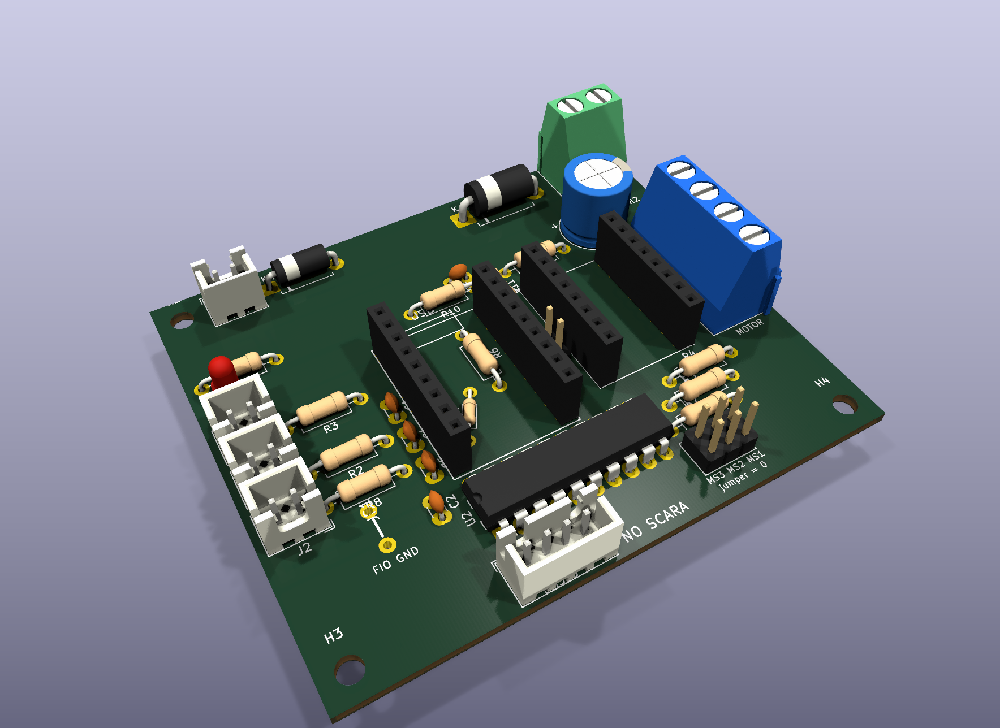

# ScaraNode — Manual da Placa

Placa de nó de motor para um braço SCARA com **Klipper**: um **RP2040-Zero** por eixo, controlando um
**TMC2209** no soquete (NEMA 17) ou um **DM556** externo (NEMA 23). Face única, feita para fresar em casa.

| | |
|---|---|
| **Projeto** | ScaraNode — nó de motor Klipper |
| **Projetista** | Daniel M. Torres |
| **Revisão** | v15 |
| **Data da revisão** | 25/09/2026 |
| **Placa** | 75,8 × 64 mm · FR-4 1,6 mm · cobre só na face de baixo (B.Cu) |
| **Ferramenta** | KiCad 10.0.6 · placa gerada por ferramenta própria em Python; fonte editável: `hardware/ScaraNode.kicad_pcb` |
| **Estado** | Validada: 128 pinos conferidos contra o esquema, DRC sem erro, vão mínimo 0,60 mm, anel mínimo 0,40 mm |

## Capítulos

| # | Capítulo | Conteúdo |
|---|---|---|
| 1 | [Visão geral](01-visao-geral.md) | O que a placa faz, especificações, blocos, diagrama |
| 2 | [Lista de materiais](02-lista-de-materiais.md) | Cada peça com foto, modelo 3D e onde encaixa |
| 3 | [Fabricação](03-fabricacao.md) | Regras de fresa, ferramentas, Gerber, espelhamento |
| 4 | [Montagem](04-montagem.md) | Ordem de solda passo a passo, polaridades, conferência |
| 5 | [Conectores, pinagem e jumpers](05-conectores-e-jumpers.md) | O que ligar em cada pino, ZM, JU, JP1 |
| 6 | [Circuitos e cálculos](06-circuitos.md) | Cada bloco explicado, com as contas |
| 7 | [Firmware Klipper](07-firmware-klipper.md) | Gravação do RP2040 e `printer.cfg` |
| 8 | [Primeira ligação e testes](08-testes.md) | Roteiro de ligação, diagnóstico, limites da placa |
| — | [Histórico de revisões](historico-de-revisoes.md) | Decisões de projeto, revisão por revisão |

**PDF:** [`ScaraNode-Manual-v15.pdf`](ScaraNode-Manual-v15.pdf), gerado destes mesmos arquivos.

## Convenções deste manual

- **Vista de cima** = lado das peças, com o USB do RP2040-Zero para cima. Todas as imagens de montagem usam
  essa vista. A única vista espelhada é a do cobre, no capítulo de fabricação.
- Coordenadas em mm, com origem no canto superior esquerdo do RP2040-Zero (mesmo referencial da ferramenta de geração).
- Nomes de rede (`24V`, `VSENSE`, `STP`…) são os mesmos da placa no KiCad.
- ⚠️ marca o que queima peça ou inutiliza a placa se for feito errado.
